# Netwatch Fullstack Architecture Document

This document outlines the complete fullstack architecture for **Netwatch**, including backend systems, frontend implementation, and their integration. It serves as the single source of truth for AI-driven development, ensuring consistency across the entire technology stack.

This unified approach combines what would traditionally be separate backend and frontend architecture documents, streamlining the development process for modern fullstack applications where these concerns are increasingly intertwined.

## Introduction

### Starter Template or Existing Project

**Analysis:** Based on the PRD and frontend specifications, this is a **greenfield project** with specific architectural constraints:

- **Go monolith backend** with AF_PACKET packet capture (highly specialized)
- **Single-binary deployment** requirement
- **Embedded static web assets** using Go embed
- **Matrix-themed cybersecurity aesthetic**
- **Real-time WebSocket updates**

**Decision:** N/A - Greenfield project with custom Go backend requirements that preclude standard fullstack starters. The specialized packet capture functionality and single-binary constraint necessitate a custom architecture.

### Change Log
| Date | Version | Description | Author |
|------|---------|-------------|--------|
| 2025-08-06 | 1.0 | Initial fullstack architecture creation from PRD and frontend spec | Winston (Architect) |

## High Level Architecture

### Technical Summary

Netwatch implements a **high-performance Go monolith architecture** with embedded web assets for zero-infrastructure deployment. The backend leverages AF_PACKET with TPACKETv3 ring buffers for efficient packet capture at 1 Gbps speeds, while the frontend delivers a matrix-themed real-time dashboard using vanilla JavaScript with WebSocket streaming. The system maintains sub-second latency through direct memory management and lock-free data structures, serving both REST APIs for programmatic access and an embedded web interface for SOCC analysts. This single-binary approach eliminates deployment complexity while achieving enterprise-grade performance targets of <5% CPU utilization and <1GB memory usage during continuous network monitoring operations.

### Platform and Infrastructure Choice

**Analysis of Platform Options:**

**Option 1: Bare Metal/VM Deployment**
- ✅ **Pros:** Direct hardware access for packet capture, maximum performance, full control over networking stack
- ❌ **Cons:** Manual deployment, no auto-scaling, infrastructure management overhead
- **Fit:** Excellent - packet capture requires privileged access and predictable performance

**Option 2: Container Platform (Docker/Kubernetes)**
- ✅ **Pros:** Portable deployment, orchestration capabilities, easier updates
- ❌ **Cons:** Networking abstraction complicates packet capture, privileged containers required
- **Fit:** Possible but complex due to CAP_NET_RAW requirements

**Option 3: Cloud Functions/Serverless**
- ❌ **Pros:** Auto-scaling, managed infrastructure
- ❌ **Cons:** Cannot access raw network interfaces, unsuitable for continuous packet capture
- **Fit:** Not viable for this use case

**Recommendation:** **Bare Metal/VM Deployment** with containerization as optional deployment method.

**Platform:** Linux bare metal or VMs with direct network interface access
**Key Services:** Single Go binary with embedded web server, no external dependencies
**Deployment Host and Regions:** On-premises or cloud VMs with network monitoring privileges

### Repository Structure

**Structure:** Monorepo with specialized Go project layout
**Monorepo Tool:** Native Go modules (no additional tooling needed for this focused project)
**Package Organization:** Standard Go project structure with embedded frontend assets

**Rationale:** Given the single-binary constraint and Go-centric nature, a simple Go module structure is most appropriate. The frontend assets are embedded rather than being a separate deployable unit, so traditional fullstack monorepo tools (Turborepo, Nx) would add unnecessary complexity.

### High Level Architecture Diagram


### Architectural Patterns

- **High-Performance Monolith:** Single binary with tightly coupled components for minimal latency - _Rationale:_ Packet processing at 1 Gbps requires elimination of inter-service network calls and optimal memory sharing
- **Embedded Assets Pattern:** Static web files compiled into Go binary using embed - _Rationale:_ Enables true single-binary deployment without external file dependencies
- **Lock-Free Data Structures:** Concurrent-safe data structures without traditional locking - _Rationale:_ Essential for maintaining <5% CPU utilization during high-throughput packet processing
- **Ring Buffer Architecture:** Circular buffers for efficient packet queue management - _Rationale:_ Minimizes memory allocation/deallocation overhead in packet processing hot path
- **WebSocket Streaming:** Real-time data push to frontend without polling - _Rationale:_ Sub-second dashboard updates required for network operations effectiveness
- **Repository Pattern:** Abstract data access for flow storage and querying - _Rationale:_ Enables future storage backend changes while maintaining API consistency
- **Component-Based UI:** Modular vanilla JavaScript components with matrix theming - _Rationale:_ Avoids framework overhead while maintaining code organization for specialized cybersecurity interface

## Tech Stack

### Technology Stack Table

| Category | Technology | Version | Purpose | Rationale |
|----------|------------|---------|---------|-----------|
| Backend Language | Go | 1.21+ | High-performance packet processing and web server | Superior concurrency, memory safety, single-binary compilation, and excellent networking libraries |
| Backend Framework | Go Standard Library + Gorilla WebSocket | stdlib + v1.5.0 | HTTP server and WebSocket handling | Minimal dependencies, maximum performance, proven stability for network applications |
| Frontend Language | JavaScript (Vanilla) | ES2020+ | Browser-based dashboard interface | Eliminates framework overhead, reduces bundle size, optimal for specialized real-time interface |
| Frontend Framework | None (Vanilla Components) | N/A | Component organization without framework | Maximum performance for real-time updates, minimal complexity for focused use case |
| UI Component Library | Custom Components + Chart.js | Chart.js v4.4.0 | Real-time data visualization | Lightweight charting for bandwidth/protocol visualization, custom matrix-themed components |
| State Management | Native JavaScript Classes | ES6+ | Application state coordination | Simple state management sufficient for dashboard app, avoids framework complexity |
| API Style | REST + WebSocket | HTTP/1.1, WebSocket | Data access and real-time streaming | RESTful APIs for programmatic access, WebSocket for sub-second dashboard updates |
| Database | In-Memory (Go Maps + Sync) | Native Go | Flow data storage and indexing | 60-minute retention requirement, maximum query speed, eliminates database overhead |
| Cache | In-Memory LRU | Custom implementation | Flow aggregation optimization | Built-in caching for flow lookup performance, no external cache needed |
| File Storage | Embedded Assets (Go embed) | Go 1.16+ embed | Static web asset delivery | Single-binary deployment, eliminates external file dependencies |
| Authentication | Optional Token-based | Custom JWT-like | API access control | Optional security layer, localhost-first design with configurable auth |
| Frontend Testing | Jest + jsdom | Jest v29.0+ | Unit testing for JS components | Lightweight testing without browser overhead, sufficient for component logic |
| Backend Testing | Go testing + testify | Go stdlib + v1.8.0 | Unit and integration testing | Native Go testing with assertion library, mock packet generation |
| E2E Testing | Playwright | v1.40+ | Full application workflow testing | Comprehensive testing of WebSocket updates and dashboard interactions |
| Build Tool | Make + Go build | Native tooling | Build automation and cross-compilation | Simple, reliable build process without additional dependencies |
| Bundler | None (Direct serving) | N/A | Asset delivery optimization | Embedded assets served directly, no bundling complexity needed |
| IaC Tool | None (Single Binary) | N/A | Infrastructure management | Deployment is binary placement, no infrastructure to manage |
| CI/CD | GitHub Actions | Latest | Automated testing and releases | Free for open source, excellent Go support, cross-platform builds |
| Monitoring | Structured Logging + Metrics Endpoint | Go stdlib + slog | Application monitoring | Built-in metrics exposure, structured logging for operational insight |
| Logging | slog (structured logging) | Go 1.21+ | Application logging and debugging | High-performance structured logging, configurable levels |
| CSS Framework | Custom Matrix Theme | CSS3 | Cybersecurity-themed styling | Matrix aesthetic requirements, specialized for SOCC environments |

## Data Models

### NetworkFlow

**Purpose:** Core entity representing aggregated network traffic between two endpoints, tracking connection metadata and traffic statistics for real-time analysis and historical querying.

**Key Attributes:**
- flowKey: string - Unique identifier based on 5-tuple hash for efficient lookup
- srcIP: net.IP - Source IP address in binary format for memory efficiency  
- dstIP: net.IP - Destination IP address in binary format for memory efficiency
- srcPort: uint16 - Source port number for transport layer identification
- dstPort: uint16 - Destination port number for transport layer identification
- protocol: uint8 - IP protocol number (TCP=6, UDP=17, ICMP=1, etc.)
- bytes: uint64 - Total bytes transferred in both directions
- packets: uint64 - Total packet count in both directions
- firstSeen: time.Time - Timestamp of first packet in flow for aging calculations
- lastSeen: time.Time - Timestamp of most recent packet for idle detection
- status: FlowStatus - Current flow state (active, idle, closed)

#### TypeScript Interface
```typescript
interface NetworkFlow {
  flowKey: string;
  srcIP: string;
  dstIP: string;
  srcPort: number;
  dstPort: number;
  protocol: number;
  protocolName: string; // Derived field for UI display
  bytes: number;
  packets: number;
  firstSeen: string; // ISO 8601 timestamp
  lastSeen: string;  // ISO 8601 timestamp
  duration: number;  // Calculated field in milliseconds
  status: 'active' | 'idle' | 'closed';
}
```

#### Relationships
- One-to-many with PacketSample (for detailed analysis)
- Aggregated into TopTalker summaries
- Referenced by SystemMetrics for bandwidth calculations

### SystemMetrics

**Purpose:** Real-time system performance and network statistics for monitoring system health and capture effectiveness.

**Key Attributes:**
- timestamp: time.Time - Metric collection timestamp for time series data
- cpuUsage: float64 - Current CPU utilization percentage
- memoryUsage: uint64 - Current memory consumption in bytes
- activeFlows: uint32 - Number of currently tracked flows
- packetsPerSecond: uint64 - Current packet capture rate
- bytesPerSecond: uint64 - Current bandwidth utilization
- droppedPackets: uint64 - Cumulative dropped packet count
- captureErrors: uint64 - Cumulative capture error count

#### TypeScript Interface
```typescript
interface SystemMetrics {
  timestamp: string;
  cpuUsage: number;
  memoryUsage: number;
  activeFlows: number;
  packetsPerSecond: number;
  bytesPerSecond: number;
  droppedPackets: number;
  captureErrors: number;
  interfaceStatus: 'up' | 'down' | 'error';
}
```

#### Relationships
- Aggregates data from NetworkFlow collection
- Used by WebSocket streaming for dashboard updates
- Historical data maintained in rolling window

### TopTalker

**Purpose:** Aggregated view of highest bandwidth consumers for dashboard visualization and rapid network analysis.

**Key Attributes:**
- identifier: string - IP address or flow identifier for ranking
- displayName: string - Human-readable identifier for UI
- totalBytes: uint64 - Aggregated byte count across all flows
- totalPackets: uint64 - Aggregated packet count across all flows
- flowCount: uint32 - Number of active flows for this talker
- rank: uint8 - Current ranking position (1-N)
- percentageOfTotal: float64 - Percentage of total network traffic

#### TypeScript Interface
```typescript
interface TopTalker {
  identifier: string;
  displayName: string;
  totalBytes: number;
  totalPackets: number;
  flowCount: number;
  rank: number;
  percentageOfTotal: number;
  flows: NetworkFlow[]; // Associated flows for drill-down
}
```

#### Relationships
- Aggregates multiple NetworkFlow entities
- Updated in real-time via WebSocket streams
- Used for click-through navigation to detailed flow analysis

## API Specification

### REST API Specification

```yaml
openapi: 3.0.0
info:
  title: Netwatch Network Monitoring API
  version: 1.0.0
  description: Real-time network flow monitoring and analysis API for high-performance packet capture and traffic analysis
servers:
  - url: http://localhost:8080/api/v1
    description: Local development server
  - url: https://netwatch.local/api/v1
    description: Production deployment

paths:
  /health:
    get:
      summary: System health check
      description: Returns current system status and capture health
      responses:
        '200':
          description: System operational
          content:
            application/json:
              schema:
                type: object
                properties:
                  status:
                    type: string
                    example: "healthy"
                  timestamp:
                    type: string
                    format: date-time
                  capture_active:
                    type: boolean
                  interface_status:
                    type: string
                    enum: [up, down, error]

  /flows:
    get:
      summary: Query network flows
      description: Retrieve filtered and paginated network flow data
      parameters:
        - name: src_ip
          in: query
          description: Filter by source IP (supports CIDR)
          schema:
            type: string
            example: "192.168.1.0/24"
        - name: dst_ip
          in: query
          description: Filter by destination IP (supports CIDR)
          schema:
            type: string
            example: "10.0.0.1"
        - name: protocol
          in: query
          description: Filter by protocol number or name
          schema:
            type: string
            example: "tcp"
        - name: port
          in: query
          description: Filter by port number (src or dst)
          schema:
            type: integer
            example: 443
        - name: time_start
          in: query
          description: Start time for flow query (ISO 8601)
          schema:
            type: string
            format: date-time
        - name: time_end
          in: query
          description: End time for flow query (ISO 8601)
          schema:
            type: string
            format: date-time
        - name: limit
          in: query
          description: Maximum number of flows to return
          schema:
            type: integer
            default: 100
            maximum: 1000
        - name: offset
          in: query
          description: Number of flows to skip
          schema:
            type: integer
            default: 0
        - name: sort_by
          in: query
          description: Sort field
          schema:
            type: string
            enum: [bytes, packets, duration, first_seen, last_seen]
            default: "last_seen"
        - name: sort_order
          in: query
          description: Sort direction
          schema:
            type: string
            enum: [asc, desc]
            default: "desc"
      responses:
        '200':
          description: Flow data retrieved successfully
          content:
            application/json:
              schema:
                type: object
                properties:
                  flows:
                    type: array
                    items:
                      $ref: '#/components/schemas/NetworkFlow'
                  pagination:
                    type: object
                    properties:
                      total_count:
                        type: integer
                      has_more:
                        type: boolean
                      limit:
                        type: integer
                      offset:
                        type: integer
        '400':
          description: Invalid query parameters
        '500':
          description: Internal server error

  /metrics:
    get:
      summary: Current system metrics
      description: Real-time system performance and network statistics
      responses:
        '200':
          description: Current metrics
          content:
            application/json:
              schema:
                $ref: '#/components/schemas/SystemMetrics'

  /metrics/history:
    get:
      summary: Historical metrics
      description: Time-series metrics data within retention window
      parameters:
        - name: duration
          in: query
          description: Duration for historical data (5m, 15m, 1h)
          schema:
            type: string
            default: "15m"
        - name: interval
          in: query
          description: Data point interval (1s, 5s, 30s)
          schema:
            type: string
            default: "5s"
      responses:
        '200':
          description: Historical metrics data
          content:
            application/json:
              schema:
                type: object
                properties:
                  metrics:
                    type: array
                    items:
                      $ref: '#/components/schemas/SystemMetrics'
                  interval:
                    type: string
                  duration:
                    type: string

  /top-talkers:
    get:
      summary: Top bandwidth consumers
      description: Current top network talkers by traffic volume
      parameters:
        - name: limit
          in: query
          description: Number of top talkers to return
          schema:
            type: integer
            default: 10
            maximum: 50
        - name: duration
          in: query
          description: Time window for calculation (5m, 15m, 1h)
          schema:
            type: string
            default: "5m"
      responses:
        '200':
          description: Top talkers data
          content:
            application/json:
              schema:
                type: object
                properties:
                  top_talkers:
                    type: array
                    items:
                      $ref: '#/components/schemas/TopTalker'
                  time_window:
                    type: string
                  generated_at:
                    type: string
                    format: date-time

  /ws:
    get:
      summary: WebSocket endpoint for real-time updates
      description: Upgrade to WebSocket for streaming real-time flow and metrics data
      responses:
        '101':
          description: WebSocket connection established
        '400':
          description: WebSocket upgrade failed

components:
  schemas:
    NetworkFlow:
      type: object
      properties:
        flowKey:
          type: string
        srcIP:
          type: string
        dstIP:
          type: string
        srcPort:
          type: integer
        dstPort:
          type: integer
        protocol:
          type: integer
        protocolName:
          type: string
        bytes:
          type: integer
          format: int64
        packets:
          type: integer
          format: int64
        firstSeen:
          type: string
          format: date-time
        lastSeen:
          type: string
          format: date-time
        duration:
          type: integer
          description: Duration in milliseconds
        status:
          type: string
          enum: [active, idle, closed]

    SystemMetrics:
      type: object
      properties:
        timestamp:
          type: string
          format: date-time
        cpuUsage:
          type: number
          format: float
        memoryUsage:
          type: integer
          format: int64
        activeFlows:
          type: integer
        packetsPerSecond:
          type: integer
          format: int64
        bytesPerSecond:
          type: integer
          format: int64
        droppedPackets:
          type: integer
          format: int64
        captureErrors:
          type: integer
          format: int64
        interfaceStatus:
          type: string
          enum: [up, down, error]

    TopTalker:
      type: object
      properties:
        identifier:
          type: string
        displayName:
          type: string
        totalBytes:
          type: integer
          format: int64
        totalPackets:
          type: integer
          format: int64
        flowCount:
          type: integer
        rank:
          type: integer
        percentageOfTotal:
          type: number
          format: float
        flows:
          type: array
          items:
            $ref: '#/components/schemas/NetworkFlow'

  securitySchemes:
    BearerAuth:
      type: http
      scheme: bearer
      description: Optional token-based authentication when security mode enabled

security:
  - BearerAuth: []
  - {} # No authentication for localhost
```

## Components

### PacketCaptureEngine

**Responsibility:** High-performance packet capture from network interfaces using AF_PACKET with TPACKETv3 ring buffers, handling raw packet processing and initial header extraction.

**Key Interfaces:**
- StartCapture(interfaceName string) error - Initialize packet capture on specified interface
- StopCapture() error - Gracefully shutdown packet capture with resource cleanup
- PacketChannel() <-chan RawPacket - Stream of captured packets for processing

**Dependencies:** Linux kernel AF_PACKET support, CAP_NET_RAW capability, network interface access

**Technology Stack:** Go with syscall package for raw socket creation, TPACKETv3 ring buffer implementation, lock-free circular buffer for packet queue management

### FlowAggregationService

**Responsibility:** Transform raw packets into network flows by aggregating 5-tuple connections, maintaining flow state, and managing flow lifecycle including aging and cleanup.

**Key Interfaces:**
- ProcessPacket(packet RawPacket) error - Process individual packet into flow aggregation
- GetFlow(flowKey string) (NetworkFlow, error) - Retrieve specific flow by identifier
- GetActiveFlows(filters FlowFilter) ([]NetworkFlow, error) - Query flows with filtering

**Dependencies:** PacketCaptureEngine packet stream, FlowStorageService for persistence, SystemMetricsCollector for statistics

**Technology Stack:** Go with concurrent-safe maps, custom 5-tuple hashing, time-based flow aging, memory pool management for packet processing

### FlowStorageService

**Responsibility:** In-memory storage and indexing of network flows with efficient query capabilities, memory management within 60-minute retention window, and multi-index support.

**Key Interfaces:**
- StoreFlow(flow NetworkFlow) error - Persist flow data with indexing
- QueryFlows(query FlowQuery) (FlowResult, error) - Execute complex flow queries
- GetTopTalkers(duration time.Duration) ([]TopTalker, error) - Calculate bandwidth rankings

**Dependencies:** None (self-contained in-memory storage)

**Technology Stack:** Go with sync.RWMutex for concurrent access, custom B-tree indexes for IP/port ranges, LRU eviction for memory management, bitmap indexing for protocol filtering

### WebSocketManager

**Responsibility:** Real-time data streaming to connected dashboard clients, managing WebSocket connections, message queuing, and client lifecycle including reconnection handling.

**Key Interfaces:**
- RegisterClient(conn WebSocketConnection) string - Add new dashboard client
- BroadcastFlowUpdate(flows []NetworkFlow) error - Send flow updates to all clients  
- BroadcastMetricsUpdate(metrics SystemMetrics) error - Send system metrics to clients

**Dependencies:** FlowStorageService for data subscription, SystemMetricsCollector for metrics streaming, HTTP server for WebSocket upgrades

**Technology Stack:** Gorilla WebSocket library, JSON message serialization, client connection pooling, message throttling and queuing

### SystemMetricsCollector

**Responsibility:** System performance monitoring including CPU/memory usage, packet capture statistics, and application health metrics with configurable collection intervals.

**Key Interfaces:**
- CollectMetrics() (SystemMetrics, error) - Gather current system performance data
- GetHistoricalMetrics(duration time.Duration) ([]SystemMetrics, error) - Retrieve time-series data
- StartCollection(interval time.Duration) error - Begin periodic metrics collection

**Dependencies:** PacketCaptureEngine for capture statistics, FlowStorageService for flow counts, OS interfaces for system metrics

**Technology Stack:** Go runtime metrics, /proc filesystem parsing for Linux system stats, rolling window data structure for historical storage, structured logging integration

### HTTPAPIServer

**Responsibility:** REST API endpoint handling for programmatic access, request routing, authentication, rate limiting, and response formatting with OpenAPI compliance.

**Key Interfaces:**
- StartServer(port int) error - Initialize HTTP server with routing
- RegisterRoutes(routes []APIRoute) error - Configure API endpoint handlers
- EnableAuthentication(config AuthConfig) error - Activate optional token-based auth

**Dependencies:** FlowStorageService for data queries, SystemMetricsCollector for metrics endpoints, WebSocketManager for WebSocket upgrades

**Technology Stack:** Go net/http standard library, gorilla/mux for routing, middleware chain for auth/logging, JSON response formatting, CORS handling

### StaticFileServer

**Responsibility:** Embedded web asset delivery including HTML, CSS, JavaScript files using Go embed, with efficient caching headers and matrix-themed dashboard serving.

**Key Interfaces:**
- ServeAssets(fs embed.FS) http.Handler - Create file server from embedded assets
- SetCacheHeaders(duration time.Duration) - Configure browser caching policy
- ServeIndex() http.HandlerFunc - Handle SPA routing with index.html fallback

**Dependencies:** Embedded web assets, HTTP server for request handling

**Technology Stack:** Go embed package for asset compilation, http.FileServer for static serving, custom middleware for cache headers, gzip compression support

### Component Diagrams


## External APIs

**No External APIs Required**

Based on the PRD requirements and system architecture analysis, Netwatch is designed as a **self-contained network monitoring solution** with no external API dependencies. This aligns with the core design principles of:

**Single-Binary Deployment:** External API dependencies would compromise the zero-infrastructure deployment goal and introduce network dependencies that could affect packet capture performance.

**Air-Gapped Network Compatibility:** Network monitoring often occurs in isolated or secure environments where external API access is restricted or prohibited.

**Performance Isolation:** The 1 Gbps packet processing requirement demands that all system resources focus on local packet analysis without external I/O that could introduce latency or processing delays.

**Operational Independence:** SOCC environments require monitoring tools that continue operating during network outages or connectivity issues that might affect external services.

## Core Workflows

### Real-time Network Monitoring Workflow


### Network Issue Investigation Workflow


### System Health Verification Workflow


## Database Schema

**In-Memory Data Structures (No Traditional Database)**

Netwatch uses specialized in-memory data structures rather than traditional database schemas to achieve the performance requirements. This section documents the internal storage organization and indexing strategies.

### Primary Flow Storage Structure

```go
// FlowTable - Primary storage container
type FlowTable struct {
    // Primary hash table for O(1) flow lookup
    flows       sync.Map                    // map[string]*NetworkFlow
    
    // Secondary indexes for query optimization  
    ipIndex     *IPRangeIndex              // Source/destination IP lookup
    portIndex   *PortRangeIndex            // Port-based filtering
    timeIndex   *TimeSeriesIndex           // Time-range queries
    protocolIdx map[uint8][]*NetworkFlow   // Protocol filtering
    
    // Memory management
    flowCount   int64                       // Current flow count
    memoryUsage int64                       // Estimated memory usage
    oldestFlow  time.Time                   // Aging boundary
    
    // Statistics
    totalFlows  uint64                      // Cumulative flow count
    lastCleanup time.Time                   // Last cleanup operation
}

// NetworkFlow storage structure optimized for memory efficiency
type NetworkFlow struct {
    // 5-tuple key (24 bytes total)
    SrcIP    [16]byte    // IPv6-compatible, 16 bytes
    DstIP    [16]byte    // IPv6-compatible, 16 bytes  
    SrcPort  uint16      // 2 bytes
    DstPort  uint16      // 2 bytes
    Protocol uint8       // 1 byte
    _        [7]byte     // Padding for alignment
    
    // Flow statistics (32 bytes)
    Bytes      uint64    // Total bytes
    Packets    uint64    // Total packets  
    FirstSeen  int64     // Unix timestamp nanoseconds
    LastSeen   int64     // Unix timestamp nanoseconds
    
    // Flow state (8 bytes)
    Status     uint8     // Active/Idle/Closed
    Direction  uint8     // Bidirectional tracking
    _          [6]byte   // Reserved for future use
    
    // Total: 64 bytes per flow for cache line efficiency
}
```

### IP Range Index Structure

```go
// IPRangeIndex - Optimized for CIDR queries and IP range lookups
type IPRangeIndex struct {
    // Separate trees for IPv4 and IPv6 for efficiency
    ipv4Tree *RadixTree[uint32, []*NetworkFlow]
    ipv6Tree *RadixTree[[16]byte, []*NetworkFlow]
    
    // Reverse lookup for flow removal
    flowToNodes map[string][]RadixNode
    
    mutex sync.RWMutex
}

// RadixTree implementation for efficient IP prefix matching
type RadixTree[K comparable, V any] struct {
    root *RadixNode[K, V]
    size int
}

type RadixNode[K comparable, V any] struct {
    key      K
    mask     int        // CIDR prefix length
    value    V          // Slice of flows matching this prefix
    children []*RadixNode[K, V]
}
```

### Time Series Index Structure  

```go
// TimeSeriesIndex - Optimized for time-range queries
type TimeSeriesIndex struct {
    // Time-based buckets for efficient range queries
    buckets map[int64]*TimeBucket  // Unix timestamp / bucket_size
    
    // Ring buffer for 60-minute retention
    bucketRing []int64             // Circular buffer of bucket timestamps
    ringIndex  int                 // Current position in ring
    
    bucketSize time.Duration       // Default: 1 minute buckets
    retention  time.Duration       // 60 minutes
    
    mutex sync.RWMutex
}

type TimeBucket struct {
    timestamp time.Time
    flows     []*NetworkFlow       // Flows active in this time bucket
    flowCount int
    totalBytes uint64
    totalPackets uint64
}
```

### System Metrics Storage

```go
// MetricsStorage - Rolling window for historical metrics
type MetricsStorage struct {
    // Circular buffer for time-series metrics
    metrics    []SystemMetrics     // Fixed size ring buffer
    capacity   int                 // Buffer size (e.g., 3600 for 1-hour at 1s intervals)
    head       int                 // Current write position
    size       int                 // Current number of metrics stored
    
    // Aggregated statistics  
    current    SystemMetrics       // Most recent metrics
    
    mutex      sync.RWMutex
}

// SystemMetrics optimized for minimal memory usage
type SystemMetrics struct {
    Timestamp        int64    // Unix timestamp nanoseconds (8 bytes)
    CPUUsage         uint16   // CPU % * 100 for precision (2 bytes)
    MemoryUsage      uint32   // Memory in KB (4 bytes)  
    ActiveFlows      uint32   // Flow count (4 bytes)
    PacketsPerSecond uint32   // Packet rate (4 bytes)
    BytesPerSecond   uint64   // Bandwidth (8 bytes)
    DroppedPackets   uint32   // Cumulative drops (4 bytes)
    CaptureErrors    uint32   // Cumulative errors (4 bytes)
    // Total: 40 bytes per metric point
}
```

## Frontend Architecture

### Component Architecture

#### Component Organization

```text
web/assets/
├── js/
│   ├── components/           # Reusable UI components
│   │   ├── Dashboard/
│   │   │   ├── BandwidthChart.js      # Real-time line chart
│   │   │   ├── ProtocolBreakdown.js   # Protocol pie chart  
│   │   │   ├── TopTalkers.js          # Live updating table
│   │   │   └── SystemStatus.js        # Health indicators
│   │   ├── FlowTable/
│   │   │   ├── FlowTable.js           # Main data table
│   │   │   ├── FlowFilters.js         # Search/filter controls
│   │   │   ├── FlowRow.js             # Individual table row
│   │   │   └── FlowExport.js          # CSV export functionality
│   │   ├── Common/
│   │   │   ├── TabNavigation.js       # Tab switching component
│   │   │   ├── WebSocketClient.js     # WebSocket management
│   │   │   ├── LoadingSpinner.js      # Loading states
│   │   │   └── StatusIndicator.js     # Connection/health status
│   │   └── Health/
│   │       ├── MetricsGrid.js         # System metrics display
│   │       ├── PerformanceChart.js    # Historical performance
│   │       └── AlertPanel.js          # System alerts
│   ├── services/             # API and data services
│   │   ├── apiClient.js      # REST API wrapper
│   │   ├── websocketService.js # Real-time data streaming
│   │   └── dataFormatter.js  # Data transformation utilities
│   ├── utils/                # Utility functions
│   │   ├── timeFormatter.js  # Timestamp formatting
│   │   ├── ipValidator.js    # IP address validation
│   │   └── keyboardHandler.js # Keyboard shortcut management
│   └── app.js               # Main application entry point
├── css/
│   ├── matrix-theme.css     # Matrix cybersecurity styling
│   ├── components.css       # Component-specific styles
│   └── dashboard.css        # Layout and grid styles
└── index.html              # Single page application shell
```

#### Component Template

```javascript
// Example: BandwidthChart.js - Real-time chart component
class BandwidthChart {
    constructor(containerId, options = {}) {
        this.container = document.getElementById(containerId);
        this.chart = null;
        this.data = [];
        this.options = {
            updateInterval: 1000,
            maxDataPoints: 300, // 5 minutes at 1s intervals
            ...options
        };
        
        this.initChart();
        this.bindEvents();
    }
    
    initChart() {
        const ctx = this.container.querySelector('canvas').getContext('2d');
        this.chart = new Chart(ctx, {
            type: 'line',
            data: {
                labels: [],
                datasets: [{
                    label: 'Bandwidth (bps)',
                    data: [],
                    borderColor: '#00FF41',
                    backgroundColor: 'rgba(0, 255, 65, 0.1)',
                    tension: 0.4
                }]
            },
            options: {
                responsive: true,
                maintainAspectRatio: false,
                animation: { duration: 0 }, // Disable for real-time
                scales: {
                    x: { type: 'time' },
                    y: { beginAtZero: true }
                }
            }
        });
    }
    
    updateData(newData) {
        const { timestamp, bytesPerSecond } = newData;
        
        // Add new data point
        this.data.push({ x: timestamp, y: bytesPerSecond });
        
        // Maintain sliding window
        if (this.data.length > this.options.maxDataPoints) {
            this.data.shift();
        }
        
        // Update chart
        this.chart.data.datasets[0].data = this.data;
        this.chart.update('none'); // Skip animation for performance
    }
    
    bindEvents() {
        // Keyboard shortcuts
        document.addEventListener('keydown', (e) => {
            if (e.ctrlKey && e.key === 'r') {
                e.preventDefault();
                this.refreshChart();
            }
        });
    }
    
    destroy() {
        if (this.chart) {
            this.chart.destroy();
        }
    }
}
```

### State Management Architecture

#### State Structure

```javascript
// AppState.js - Centralized application state
class AppState {
    constructor() {
        this.state = {
            // Connection state
            websocket: {
                connected: false,
                reconnecting: false,
                lastUpdate: null
            },
            
            // Dashboard data
            dashboard: {
                metrics: null,
                flows: [],
                topTalkers: [],
                protocolBreakdown: {}
            },
            
            // Flow table state  
            flowTable: {
                flows: [],
                filters: {
                    searchTerm: '',
                    protocol: 'all',
                    timeRange: '5m',
                    sortBy: 'lastSeen',
                    sortOrder: 'desc'
                },
                pagination: {
                    offset: 0,
                    limit: 100,
                    total: 0
                }
            },
            
            // UI state
            ui: {
                activeTab: 'dashboard',
                loading: false,
                error: null,
                alerts: []
            }
        };
        
        this.subscribers = new Map();
        this.history = []; // For debugging
    }
    
    subscribe(path, callback) {
        if (!this.subscribers.has(path)) {
            this.subscribers.set(path, new Set());
        }
        this.subscribers.get(path).add(callback);
        
        // Return unsubscribe function
        return () => this.subscribers.get(path).delete(callback);
    }
    
    setState(path, value) {
        const oldValue = this.getState(path);
        this.setNestedProperty(this.state, path, value);
        
        // Store history for debugging
        this.history.push({
            timestamp: Date.now(),
            path,
            oldValue,
            newValue: value
        });
        
        // Notify subscribers
        this.notifySubscribers(path, value, oldValue);
    }
    
    getState(path) {
        return this.getNestedProperty(this.state, path);
    }
    
    // Helper methods for nested property access
    setNestedProperty(obj, path, value) {
        const keys = path.split('.');
        const lastKey = keys.pop();
        const target = keys.reduce((o, k) => o[k], obj);
        target[lastKey] = value;
    }
    
    getNestedProperty(obj, path) {
        return path.split('.').reduce((o, k) => o && o[k], obj);
    }
    
    notifySubscribers(path, newValue, oldValue) {
        const subscribers = this.subscribers.get(path);
        if (subscribers) {
            subscribers.forEach(callback => callback(newValue, oldValue));
        }
    }
}

// Global state instance
const appState = new AppState();
```

#### State Management Patterns

- **Immutable Updates:** State changes create new objects rather than mutating existing ones for predictable updates
- **Path-based Subscriptions:** Components subscribe to specific state paths to minimize unnecessary re-renders
- **Action-based Updates:** State modifications through explicit actions for debugging and consistency
- **Local Component State:** Transient UI state (hover, focus) managed locally to reduce global state complexity

### Routing Architecture

#### Route Organization

```text
Application Routes (Hash-based for SPA):
├── #/dashboard           # Default route - real-time dashboard
├── #/flows              # Flow analysis table
├── #/flows/:flowId      # Individual flow details (future)
├── #/health             # System health monitoring
└── #/settings           # Configuration (future)

Tab Navigation:
- Ctrl+1 → Dashboard
- Ctrl+2 → Flows  
- Ctrl+3 → Health
```

## Backend Architecture

### Service Architecture

Since we've chosen a traditional monolithic server architecture, the backend is organized around Go packages and services within a single binary.

#### Controller Organization

```text
internal/
├── capture/                  # Packet capture service
│   ├── engine.go            # AF_PACKET capture engine
│   ├── ring_buffer.go       # TPACKETv3 ring buffer implementation
│   ├── packet_parser.go     # Packet header extraction
│   └── interface_manager.go # Network interface management
├── flow/                    # Flow processing service  
│   ├── aggregator.go        # Packet-to-flow aggregation
│   ├── storage.go           # In-memory flow storage
│   ├── indexer.go           # Multi-index management
│   └── cleaner.go           # Flow aging and cleanup
├── api/                     # HTTP API controllers
│   ├── router.go            # Route definitions
│   ├── handlers/            # HTTP handlers
│   │   ├── flows.go         # Flow query endpoints
│   │   ├── metrics.go       # System metrics endpoints
│   │   ├── health.go        # Health check endpoints
│   │   └── websocket.go     # WebSocket upgrade handler
│   └── middleware/          # HTTP middleware
│       ├── cors.go          # CORS handling
│       ├── auth.go          # Optional authentication
│       ├── rate_limit.go    # Rate limiting
│       └── logging.go       # Request logging
├── metrics/                 # System monitoring
│   ├── collector.go         # Metrics collection
│   ├── storage.go           # Time-series storage
│   └── calculator.go        # Statistics calculation
├── websocket/               # Real-time streaming
│   ├── manager.go           # Connection management
│   ├── broadcaster.go       # Message broadcasting
│   └── client.go            # Individual client handling
└── config/                  # Configuration management
    ├── config.go            # Configuration structs
    ├── validation.go        # Config validation
    └── defaults.go          # Default values
```

### Authentication and Authorization

#### Auth Flow


## Unified Project Structure

```plaintext
netwatch/
├── .github/                    # CI/CD workflows
│   └── workflows/
│       ├── ci.yaml
│       ├── release.yaml
│       └── security.yaml
├── cmd/                        # Application entry points
│   └── netwatch/
│       └── main.go            # Main application entry
├── internal/                   # Private application code
│   ├── capture/               # Packet capture engine
│   │   ├── engine.go
│   │   ├── ring_buffer.go
│   │   ├── packet_parser.go
│   │   └── interface_manager.go
│   ├── flow/                  # Flow processing and storage
│   │   ├── aggregator.go
│   │   ├── storage.go
│   │   ├── indexer.go
│   │   ├── cleaner.go
│   │   └── repository.go
│   ├── api/                   # HTTP API layer
│   │   ├── router.go
│   │   ├── handlers/
│   │   │   ├── flows.go
│   │   │   ├── metrics.go
│   │   │   ├── health.go
│   │   │   └── websocket.go
│   │   └── middleware/
│   │       ├── cors.go
│   │       ├── auth.go
│   │       ├── rate_limit.go
│   │       └── logging.go
│   ├── websocket/             # Real-time streaming
│   │   ├── manager.go
│   │   ├── broadcaster.go
│   │   └── client.go
│   ├── metrics/               # System monitoring
│   │   ├── collector.go
│   │   ├── storage.go
│   │   └── calculator.go
│   └── config/                # Configuration management
│       ├── config.go
│       ├── validation.go
│       └── defaults.go
├── pkg/                       # Public library code
│   ├── types/                 # Shared data types
│   │   ├── flow.go
│   │   ├── metrics.go
│   │   └── api.go
│   ├── logger/                # Logging utilities
│   │   ├── logger.go
│   │   └── structured.go
│   └── utils/                 # Common utilities
│       ├── ip.go              # IP address utilities
│       ├── time.go            # Time formatting
│       └── validation.go      # Input validation
├── web/                       # Frontend assets (embedded)
│   ├── assets/
│   │   ├── js/
│   │   │   ├── components/    # UI components
│   │   │   │   ├── Dashboard/
│   │   │   │   │   ├── BandwidthChart.js
│   │   │   │   │   ├── ProtocolBreakdown.js
│   │   │   │   │   ├── TopTalkers.js
│   │   │   │   │   └── SystemStatus.js
│   │   │   │   ├── FlowTable/
│   │   │   │   │   ├── FlowTable.js
│   │   │   │   │   ├── FlowFilters.js
│   │   │   │   │   ├── FlowRow.js
│   │   │   │   │   └── FlowExport.js
│   │   │   │   ├── Common/
│   │   │   │   │   ├── TabNavigation.js
│   │   │   │   │   ├── WebSocketClient.js
│   │   │   │   │   ├── LoadingSpinner.js
│   │   │   │   │   └── StatusIndicator.js
│   │   │   │   └── Health/
│   │   │   │       ├── MetricsGrid.js
│   │   │   │       ├── PerformanceChart.js
│   │   │   │       └── AlertPanel.js
│   │   │   ├── services/      # API services
│   │   │   │   ├── apiClient.js
│   │   │   │   ├── websocketService.js
│   │   │   │   └── dataFormatter.js
│   │   │   ├── utils/         # Frontend utilities
│   │   │   │   ├── timeFormatter.js
│   │   │   │   ├── ipValidator.js
│   │   │   │   └── keyboardHandler.js
│   │   │   └── app.js         # Main application
│   │   ├── css/
│   │   │   ├── matrix-theme.css
│   │   │   ├── components.css
│   │   │   └── dashboard.css
│   │   └── vendor/            # Third-party libraries
│   │       ├── chart.js       # Chart.js for visualizations
│   │       └── normalize.css  # CSS normalization
│   └── index.html             # SPA shell
├── tests/                     # Test files
│   ├── integration/           # Integration tests
│   │   ├── api_test.go
│   │   ├── capture_test.go
│   │   └── websocket_test.go
│   ├── unit/                  # Unit tests
│   │   ├── flow/
│   │   │   ├── aggregator_test.go
│   │   │   ├── storage_test.go
│   │   │   └── repository_test.go
│   │   ├── capture/
│   │   │   ├── engine_test.go
│   │   │   └── parser_test.go
│   │   └── api/
│   │       ├── handlers_test.go
│   │       └── middleware_test.go
│   ├── mocks/                 # Mock implementations
│   │   ├── packet_generator.go
│   │   ├── mock_storage.go
│   │   └── mock_interfaces.go
│   └── e2e/                   # End-to-end tests
│       ├── playwright/
│       │   ├── dashboard.spec.js
│       │   ├── flow-table.spec.js
│       │   └── websocket.spec.js
│       └── fixtures/
│           ├── test-packets.pcap
│           └── flow-data.json
├── scripts/                   # Build and utility scripts
│   ├── build.sh              # Cross-platform build script
│   ├── test.sh               # Test runner
│   ├── generate-mocks.sh     # Mock generation
│   └── release.sh            # Release packaging
├── configs/                   # Configuration files
│   ├── netwatch.yaml.example # Example configuration
│   ├── docker/               # Docker configurations
│   │   ├── Dockerfile
│   │   ├── Dockerfile.dev
│   │   └── docker-compose.yml
│   └── systemd/              # Systemd service files
│       └── netwatch.service
├── docs/                     # Documentation
│   ├── prd.md
│   ├── front-end-spec.md
│   ├── architecture.md       # This document
│   ├── api/                  # API documentation
│   │   ├── openapi.yaml
│   │   └── websocket.md
│   ├── deployment/           # Deployment guides
│   │   ├── linux.md
│   │   ├── docker.md
│   │   └── systemd.md
│   └── development/          # Development guides
│       ├── setup.md
│       ├── testing.md
│       └── contributing.md
├── .env.example              # Environment template
├── .gitignore
├── .dockerignore
├── go.mod                    # Go module definition
├── go.sum                    # Go module checksums
├── Makefile                  # Build automation
└── README.md
```

## Development Workflow

### Local Development Setup

#### Prerequisites

```bash
# Go development environment
go version  # Should be 1.21 or higher
export GOPATH=$HOME/go
export PATH=$PATH:$GOPATH/bin

# Development tools
go install github.com/golangci/golangci-lint/cmd/golangci-lint@latest
go install github.com/vektra/mockery/v2@latest

# Testing tools
npm install -g playwright
playwright install

# Optional: Docker for containerized development
docker --version
docker-compose --version
```

#### Initial Setup

```bash
# Clone repository and setup Go modules
git clone https://github.com/your-org/netwatch.git
cd netwatch
go mod download
go mod tidy

# Generate mocks for testing
make generate-mocks

# Build development binary
make build-dev

# Setup development configuration
cp .env.example .env
cp configs/netwatch.yaml.example configs/netwatch.yaml

# Install frontend dependencies (minimal for vanilla JS)
# No package.json needed - using CDN/embedded libraries

# Verify setup
make test-unit
make test-integration
```

#### Development Commands

```bash
# Start all services
make dev

# Start backend only (with file watching)
make dev-backend

# Start frontend development server (for asset development)
make dev-frontend

# Run tests
make test          # Run all tests
make test-unit     # Unit tests only  
make test-integration  # Integration tests
make test-e2e      # End-to-end tests
make test-performance  # Performance benchmarks

# Development utilities
make lint          # Run linter
make fmt           # Format code
make generate      # Generate code (mocks, etc.)
make clean         # Clean build artifacts
```

### Environment Configuration

#### Required Environment Variables

```bash
# Frontend (.env.local)
# No environment variables needed - configuration embedded

# Backend (.env)
NETWATCH_INTERFACE=eth0
NETWATCH_PORT=8080
NETWATCH_LOG_LEVEL=debug
NETWATCH_AUTH_ENABLED=false
NETWATCH_AUTH_TOKEN=development-token-change-in-production

# Performance tuning
NETWATCH_RING_BUFFER_SIZE=16777216    # 16MB ring buffer
NETWATCH_MAX_FLOWS=1000000            # Maximum flows in memory
NETWATCH_CLEANUP_INTERVAL=60s         # Flow cleanup interval
NETWATCH_METRICS_INTERVAL=5s          # System metrics collection

# Shared
NETWATCH_ENVIRONMENT=development
```

## Deployment Architecture

### Deployment Strategy

**Frontend Deployment:**
- **Platform:** Embedded in Go binary (no separate deployment)
- **Build Command:** `go build -ldflags="-X main.version=$(VERSION)" ./cmd/netwatch`
- **Output Directory:** Single binary executable
- **CDN/Edge:** Static assets served directly from embedded filesystem

**Backend Deployment:**
- **Platform:** Linux bare metal or VMs with CAP_NET_RAW capability
- **Build Command:** `make build-release` (cross-compilation for multiple architectures)
- **Deployment Method:** Direct binary placement with systemd service management

### CI/CD Pipeline

```yaml
name: Netwatch CI/CD
on:
  push:
    branches: [main, develop]
  pull_request:
    branches: [main]

jobs:
  test:
    runs-on: ubuntu-latest
    steps:
      - uses: actions/checkout@v4
      - uses: actions/setup-go@v5
        with:
          go-version: '1.21'
      - name: Run tests
        run: |
          make test-unit
          make test-integration
      - name: Run linter
        run: make lint
  
  build:
    needs: test
    runs-on: ubuntu-latest
    strategy:
      matrix:
        goos: [linux]
        goarch: [amd64, arm64]
    steps:
      - uses: actions/checkout@v4
      - uses: actions/setup-go@v5
        with:
          go-version: '1.21'
      - name: Build binary
        env:
          GOOS: ${{ matrix.goos }}
          GOARCH: ${{ matrix.goarch }}
        run: make build-release
      - name: Upload artifacts
        uses: actions/upload-artifact@v4
        with:
          name: netwatch-${{ matrix.goos }}-${{ matrix.goarch }}
          path: bin/netwatch*
  
  release:
    if: startsWith(github.ref, 'refs/tags/')
    needs: build
    runs-on: ubuntu-latest
    steps:
      - name: Create Release
        uses: softprops/action-gh-release@v1
        with:
          files: bin/*
```

### Environments

| Environment | Frontend URL | Backend URL | Purpose |
|-------------|--------------|-------------|---------|
| Development | http://localhost:8080 | http://localhost:8080/api/v1 | Local development |
| Staging | http://staging-netwatch.local | http://staging-netwatch.local/api/v1 | Pre-production testing |
| Production | http://netwatch.local | http://netwatch.local/api/v1 | Live environment |

## Security and Performance

### Security Requirements

**Frontend Security:**
- CSP Headers: `default-src 'self'; script-src 'self' 'unsafe-inline'; style-src 'self' 'unsafe-inline'`
- XSS Prevention: Input sanitization for IP addresses and search terms, no user-generated content
- Secure Storage: WebSocket tokens stored in memory only, no persistent storage of sensitive data

**Backend Security:**
- Input Validation: IP address CIDR validation, port range validation, SQL injection prevention in query parameters
- Rate Limiting: 100 requests/minute per client IP, 1000 requests/minute for localhost
- CORS Policy: Restricted to same-origin by default, configurable for development

**Authentication Security:**
- Token Storage: Bearer tokens in Authorization headers, optional environment-based configuration
- Session Management: Stateless token validation, no server-side session storage
- Password Policy: Token-based authentication only, no password requirements

### Performance Optimization

**Frontend Performance:**
- Bundle Size Target: <100KB total (excluding Chart.js), minimal JavaScript framework overhead
- Loading Strategy: Progressive loading of components, lazy loading for non-critical features
- Caching Strategy: Browser caching with 1-hour TTL for static assets, real-time data not cached

**Backend Performance:**
- Response Time Target: <100ms for API queries, <1s for complex flow filtering
- Database Optimization: In-memory indexes, O(1) flow lookups, concurrent query processing
- Caching Strategy: In-memory LRU caching for frequent queries, no external cache dependencies

## Testing Strategy

### Testing Pyramid

```text
                E2E Tests (10)
               /              \
          Integration Tests (50)
             /                    \
        Frontend Unit (100)  Backend Unit (200)
```

### Test Organization

#### Frontend Tests

```text
tests/e2e/playwright/
├── dashboard.spec.js          # Real-time dashboard functionality
├── flow-table.spec.js         # Flow filtering and sorting
├── websocket.spec.js          # Real-time updates
└── keyboard-navigation.spec.js # SOCC analyst workflows
```

#### Backend Tests

```text
tests/unit/
├── capture/
│   ├── engine_test.go         # Packet capture functionality
│   ├── parser_test.go         # Protocol parsing
│   └── ring_buffer_test.go    # Memory management
├── flow/
│   ├── aggregator_test.go     # Flow aggregation logic
│   ├── storage_test.go        # In-memory storage
│   └── indexer_test.go        # Query performance
└── api/
    ├── handlers_test.go       # HTTP endpoints
    └── websocket_test.go      # Real-time streaming
```

#### E2E Tests

```text
tests/e2e/
├── full-workflow.spec.js      # End-to-end monitoring workflow
├── performance.spec.js        # Load testing with mock packets
└── failure-scenarios.spec.js  # Network interface failures
```

## Coding Standards

### Critical Fullstack Rules

- **Performance First:** All code changes must maintain <5% CPU usage target - benchmark before merging
- **Memory Management:** Flow storage must never exceed 1GB - implement proper cleanup and monitoring
- **Error Handling:** All packet processing errors must be non-blocking - system continues operation
- **Real-time Priority:** WebSocket updates take precedence over HTTP API responses during high load
- **Security Validation:** All IP address and port inputs must be validated before processing
- **Logging Standards:** Use structured logging with consistent field names across frontend and backend

### Naming Conventions

| Element | Frontend | Backend | Example |
|---------|----------|---------|---------|
| Components | PascalCase | - | `BandwidthChart.js` |
| Functions | camelCase | camelCase | `updateFlowData()`, `ProcessPacket()` |
| API Endpoints | - | kebab-case | `/api/v1/top-talkers` |
| Go Packages | - | lowercase | `internal/capture` |
| Constants | UPPER_CASE | UPPER_CASE | `MAX_FLOWS`, `DEFAULT_PORT` |

## Error Handling Strategy

### Error Flow

```mermaid
sequenceDiagram
    participant Frontend as Web Dashboard
    participant API as HTTP API
    participant Storage as Flow Storage
    participant Capture as Packet Engine

    Note over Frontend,Capture: Error Propagation Flow

    Capture->>Capture: Packet capture error
    Capture->>Storage: Log error, continue processing
    Storage->>API: Include error count in metrics
    API->>Frontend: Error metrics in response
    Frontend->>Frontend: Display error indicator

    alt Critical System Error
        Capture->>API: System failure notification
        API->>Frontend: WebSocket error broadcast
        Frontend->>Frontend: Show system offline state
    end

    alt Network Request Error
        Frontend->>API: API request fails
        API-->>Frontend: HTTP error response
        Frontend->>Frontend: Show user-friendly error message
        Frontend->>Frontend: Retry with exponential backoff
    end
```



### Error Response Format

```typescript
interface ApiError {
  error: {
    code: string;
    message: string;
    details?: Record<string, any>;
    timestamp: string;
    requestId: string;
  };
}
```

### Frontend Error Handling

```javascript
class ErrorHandler {
    static handleApiError(error, context) {
        const userMessage = this.getUserFriendlyMessage(error.code);
        appState.setState('ui.error', userMessage);
        
        // Log full error details for debugging
        console.error('API Error:', {
            code: error.code,
            message: error.message,
            context: context,
            timestamp: error.timestamp
        });
    }
    
    static getUserFriendlyMessage(errorCode) {
        const messages = {
            'CAPTURE_FAILED': 'Network capture temporarily unavailable',
            'MEMORY_LIMIT': 'System memory limit reached - older data cleared',
            'INTERFACE_DOWN': 'Network interface offline - check connection'
        };
        return messages[errorCode] || 'System temporarily unavailable';
    }
}
```

### Backend Error Handling

```go
type ErrorHandler struct {
    logger logger.Logger
}

func (h *ErrorHandler) HandleCaptureError(err error, context string) {
    // Log error but don't stop capture
    h.logger.Error("Packet capture error", 
        "error", err, 
        "context", context,
        "action", "continue_processing")
    
    // Update error metrics
    metrics.IncrementCaptureErrors()
}

func (h *ErrorHandler) HandleAPIError(w http.ResponseWriter, err error, requestID string) {
    statusCode := h.getStatusCode(err)
    errorResponse := APIError{
        Error: ErrorDetail{
            Code:      h.getErrorCode(err),
            Message:   h.getUserMessage(err),
            Timestamp: time.Now(),
            RequestID: requestID,
        },
    }
    
    w.Header().Set("Content-Type", "application/json")
    w.WriteHeader(statusCode)
    json.NewEncoder(w).Encode(errorResponse)
}
```

## Monitoring and Observability

### Monitoring Stack

- **Frontend Monitoring:** Browser performance API, WebSocket connection tracking, user interaction metrics
- **Backend Monitoring:** Go runtime metrics, custom application metrics, structured logging
- **Error Tracking:** Centralized error logging with context, error rate monitoring and alerting
- **Performance Monitoring:** Packet capture rates, flow processing latency, memory usage trending

### Key Metrics

**Frontend Metrics:**
- Dashboard load time (<2 seconds target)
- WebSocket connection stability (>99% uptime)
- Chart rendering performance (60fps during updates)
- User interaction response time (<100ms)

**Backend Metrics:**
- Packet capture rate (target: sustained 1 Gbps)
- Flow processing latency (<1ms per packet average)
- Memory usage (target: <1GB total)
- API response time (<100ms 95th percentile)
- Active flow count and growth rate

---

## Architecture Completion Summary

🏗️ **Netwatch Full-Stack Architecture Complete**

This comprehensive architecture document provides the complete technical foundation for building Netwatch - a high-performance network monitoring system with real-time visualization capabilities. The architecture emphasizes:

**Core Achievements:**
- **Performance-Optimized Design:** Single-binary Go monolith targeting 1 Gbps packet capture with <5% CPU usage
- **Real-Time Capabilities:** Sub-second WebSocket streaming with matrix-themed cybersecurity dashboard
- **Zero-Infrastructure Deployment:** Embedded web assets and in-memory storage eliminate external dependencies
- **Comprehensive Coverage:** Complete specifications for frontend, backend, data models, APIs, testing, and deployment

**Ready for Development:** All architectural decisions have been made with detailed rationale, enabling immediate AI-driven development using this document as the definitive technical reference.

The architecture successfully translates the PRD requirements and frontend specifications into a cohesive, implementable system design optimized for SOCC analyst workflows and DevOps automation needs.