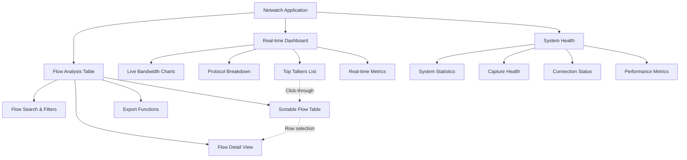
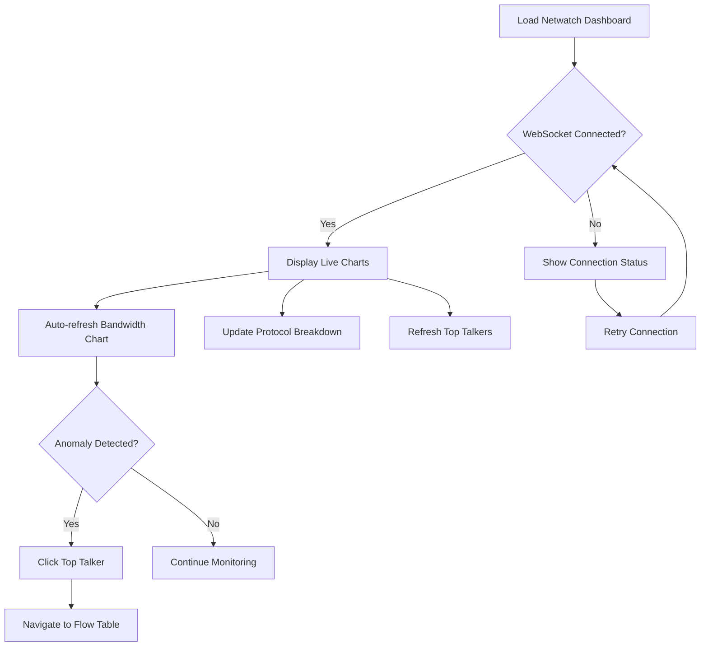
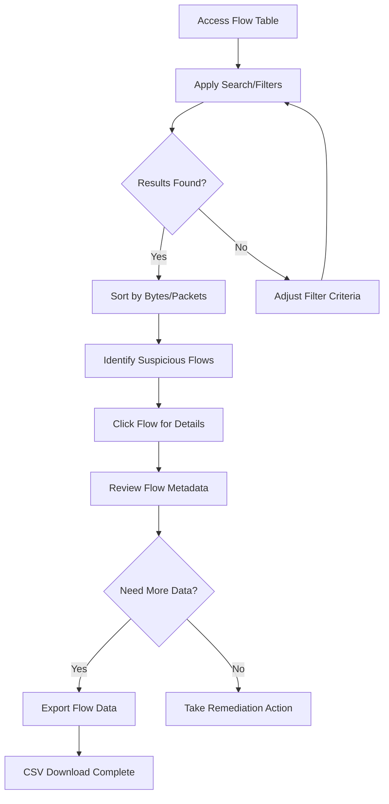
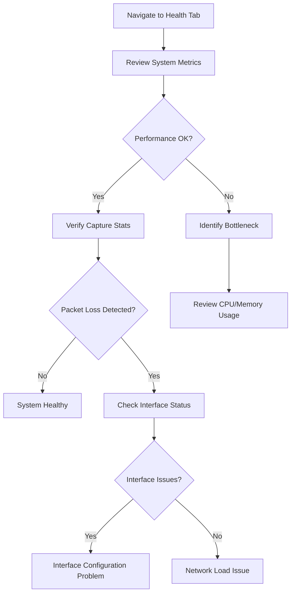

# Netwatch UI/UX Specification

## Introduction

This document defines the user experience goals, information architecture, user flows, and visual design specifications for Netwatch's user interface. It serves as the foundation for visual design and frontend development, ensuring a cohesive and user-centered experience.

### Overall UX Goals & Principles

#### Target User Personas

**Primary: Network Operations Specialist**
- 3-10 years experience managing enterprise networks (10-500 hosts)
- Works in SOCC/NOC environments with multiple monitoring screens
- Values information density and rapid troubleshooting capabilities
- Comfortable with technical interfaces and command-line tools
- Success metric: Identify network issues within 2 minutes

**Secondary: DevOps Engineer** 
- Application-focused professional managing containerized workloads
- Needs to correlate network patterns with application performance
- Works in fast-paced, automation-heavy environments
- Prefers API integration but occasionally uses web interface
- Success metric: Quickly validate if network issues affect application performance

**Tertiary: Security Analyst**
- SOC analyst investigating potential security incidents
- Uses matrix-themed tools and expects familiar cybersecurity aesthetics
- Needs rapid flow analysis for incident response
- Values keyboard shortcuts and efficient workflows
- Success metric: Rapidly identify unusual traffic patterns during incidents

#### Usability Goals

**Immediate Recognition:** Users can identify top bandwidth consumers within 30 seconds of dashboard load
**Rapid Troubleshooting:** Network administrators identify issues within 2 minutes using dashboard + flow table
**Keyboard Efficiency:** Power users complete common tasks using keyboard shortcuts without mouse interaction
**Data Density:** Interface presents maximum useful information without cognitive overload
**Real-time Confidence:** Users trust data freshness with clear visual indicators of WebSocket connection status

#### Design Principles

1. **Operations-First Design** - Prioritize functional efficiency over visual aesthetics; information density serves rapid decision-making
2. **Matrix Cybersecurity Aesthetic** - Leverage familiar green-on-black terminal styling to create immediate user comfort in SOCC environments
3. **Real-time Transparency** - Every piece of data shows its freshness; users never question if information is current
4. **Keyboard-Centric Workflows** - All primary functions accessible via keyboard; mouse interaction optional for power users
5. **Progressive Data Disclosure** - Start with dashboard overview, drill down to flow details; each level provides appropriate detail for the task

### Change Log
| Date | Version | Description | Author |
|------|---------|-------------|--------|
| 2025-08-06 | 1.0 | Initial UI/UX specification creation from PRD | UX Expert |

## Information Architecture

### Site Map / Screen Inventory

### Navigation Structure

**Primary Navigation:** Tab-based interface with three main sections accessible via Ctrl+1/2/3:
- Dashboard (default landing) - Real-time network overview with live charts and top talkers
- Flows - Detailed flow analysis table with search, filtering, and export capabilities  
- Health - System status, capture statistics, and performance monitoring

**Secondary Navigation:** Within each tab, contextual controls and filters:
- Dashboard: Time window controls (1min/5min/15min/60min), auto-refresh pause/resume
- Flows: Search bar, filter controls, column sorting, export options
- Health: Metric selection, historical views, diagnostic actions

**Breadcrumb Strategy:** No traditional breadcrumbs needed due to flat three-tab structure. Current tab highlighted with matrix green accent. Deep-linking supports direct tab access (/dashboard, /flows, /health).

## User Flows

### Flow 1: Real-time Network Monitoring

**User Goal:** Network administrator needs to quickly assess current network health and identify any immediate issues

**Entry Points:** 
- Direct URL/bookmark to dashboard
- Post-deployment health check
- Routine monitoring check

**Success Criteria:** User identifies network status and any top bandwidth consumers within 30 seconds

#### Flow Diagram

#### Edge Cases & Error Handling:
- WebSocket connection failure: Display clear offline indicator, retry automatically, allow manual refresh
- No network traffic: Show "No active flows" message with system status confirmation
- High latency updates: Show data staleness indicators, warn if updates are delayed >5 seconds
- Browser tab backgrounded: Maintain updates but reduce frequency to preserve performance

**Notes:** This flow emphasizes immediate visual feedback and graceful degradation when real-time updates fail.

### Flow 2: Network Issue Investigation

**User Goal:** When alerted to network problems, administrator needs to drill down into specific flows to identify root cause

**Entry Points:**
- Click from dashboard top talkers
- Direct search in flow table
- Alert/monitoring system link

**Success Criteria:** User isolates problematic flows and gathers sufficient detail for remediation within 2 minutes

#### Flow Diagram

#### Edge Cases & Error Handling:
- Large result sets: Implement pagination/virtual scrolling, show result count warnings
- Search syntax errors: Provide inline validation, suggest correct IP/port formats
- Export failures: Retry mechanism, alternative formats, partial export options
- Flow details unavailable: Show available metadata, explain data retention limits

**Notes:** Flow emphasizes rapid filtering and data export for external analysis tools.

### Flow 3: System Health Verification

**User Goal:** Administrator needs to verify Netwatch is operating correctly and capture performance is optimal

**Entry Points:**
- System Health tab
- Performance degradation investigation
- Routine system check

**Success Criteria:** User confirms system health and identifies any performance issues within 1 minute

#### Flow Diagram

#### Edge Cases & Error Handling:
- Metrics collection failure: Show last known values with timestamps, retry collection
- Performance degradation: Highlight problematic metrics, provide troubleshooting suggestions
- Capture interface offline: Clear error message, suggest interface restart procedures
- Memory/CPU alerts: Show trends, suggest configuration adjustments

**Notes:** Flow focuses on rapid system diagnostics and clear problem identification.

## Wireframes & Mockups

**Primary Design Files:** Given the technical nature and specific matrix aesthetic requirements, I recommend creating detailed wireframes in **Figma** for collaborative design iteration and developer handoff. The matrix theme requires careful attention to color contrast and terminal-style typography that benefits from visual design tools.

### Key Screen Layouts

#### Dashboard - Real-time Network Monitor
**Purpose:** Primary landing screen providing immediate network visibility with live updating charts and top bandwidth consumers

**Key Elements:**
- **Header Bar:** Netwatch branding, WebSocket connection status indicator, global refresh control (pause/resume)
- **Primary Charts Section:** Side-by-side bandwidth line chart (bps/pps) with time window controls (1m/5m/15m/60m)
- **Secondary Metrics:** Protocol breakdown (pie/donut chart) and system health summary in smaller panels
- **Top Talkers Table:** Real-time updating table showing highest bandwidth consumers with click-through to flow details
- **Status Footer:** Capture statistics, active flow count, last update timestamp

**Interaction Notes:** 
- Charts update via WebSocket without full page refresh
- Time window controls immediately adjust chart scope with smooth transitions
- Top talkers rows are clickable, navigating to Flow tab with pre-filtered results
- Keyboard shortcuts (Ctrl+1, Space for pause/resume, F5 for force refresh) overlay any focused element

**Design File Reference:** `/wireframes/dashboard-layout.figma` (to be created)

#### Flow Analysis Table
**Purpose:** Detailed flow investigation interface with advanced search, filtering, and export capabilities

**Key Elements:**
- **Search & Filter Bar:** Intelligent search input with filter buttons for IP ranges, ports, protocols, time ranges
- **Data Table:** Sortable columns (Src IP, Dst IP, Src Port, Dst Port, Protocol, Bytes, Packets, Duration, First Seen, Last Seen)
- **Table Controls:** Column sorting indicators, pagination controls, results count display
- **Export Panel:** CSV export button with filter preservation, format options
- **Filter State Display:** Active filters shown as removable chips above table

**Interaction Notes:**
- Table updates in real-time via WebSocket while preserving scroll position and selections
- Search input provides inline validation for IP addresses and port ranges
- Multi-column sorting supported with visual priority indicators (1st, 2nd sort)
- Monospace fonts for IP addresses ensure consistent alignment
- Flow row selection highlights with matrix green accent

**Design File Reference:** `/wireframes/flow-table-layout.figma` (to be created)

#### System Health Dashboard  
**Purpose:** System diagnostic interface showing capture performance, resource utilization, and operational status

**Key Elements:**
- **System Metrics Grid:** CPU usage, memory consumption, capture statistics in card layout
- **Performance Charts:** Historical CPU/memory trends, packet capture rates over time
- **Interface Status:** Network interface health, capture errors, ring buffer utilization
- **Diagnostic Actions:** Interface restart buttons, log export, configuration validation
- **Alert Panel:** System warnings, performance degradation notifications

**Interaction Notes:**
- Metrics update on slower refresh cycle (5-10 seconds) to reduce system load
- Alert states use matrix color coding (green=healthy, amber=warning, red=critical)
- Diagnostic actions require confirmation dialogs for destructive operations
- Performance charts support hover tooltips with precise values

**Design File Reference:** `/wireframes/health-dashboard-layout.figma` (to be created)

## Component Library / Design System

**Design System Approach:** Create a **custom lightweight design system** optimized for real-time data visualization and matrix cybersecurity aesthetics. This approach prioritizes performance over comprehensive design tokens, focusing on the essential components needed for network monitoring interfaces.

### Core Components

#### NetwatchButton
**Purpose:** Primary interactive element for actions, controls, and navigation

**Variants:** 
- Primary (matrix green, high contrast)
- Secondary (outline style with green border)  
- Danger (red for destructive actions)
- Ghost (minimal styling for secondary actions)

**States:** Default, Hover, Active, Disabled, Loading (with spinner)

**Usage Guidelines:** Use Primary for main actions (Export, Apply Filters), Secondary for toggles (Pause/Resume), Danger for system actions (Restart Interface). Maximum 1 Primary button per screen section.

#### DataTable  
**Purpose:** Core component for displaying flow data, metrics, and system information with real-time updates

**Variants:**
- Standard (basic sortable table)
- Filterable (includes search and filter controls)
- Exportable (includes export functionality)
- Real-time (WebSocket-enabled live updates)

**States:** Loading, Populated, Empty, Error, Updating (subtle animation during refresh)

**Usage Guidelines:** Always include loading states for async data. Use monospace fonts for IP addresses and ports. Implement virtual scrolling for >1000 rows. Highlight active sorts with matrix green indicators.

#### StatusIndicator
**Purpose:** System health and connection status visualization with clear state communication

**Variants:**
- Connection Status (WebSocket connectivity)
- System Health (CPU/Memory/Capture status)  
- Data Freshness (last update timestamp)
- Alert Level (info/warning/error states)

**States:** Healthy (green), Warning (amber), Error (red), Unknown (gray), Connecting (pulsing)

**Usage Guidelines:** Always visible in header area. Include tooltips with detailed status information. Use consistent color coding across all status types. Animate state transitions smoothly.

#### TimeSeriesChart
**Purpose:** Real-time bandwidth and metrics visualization with smooth updates and user controls

**Variants:**
- Line Chart (bandwidth over time)
- Area Chart (stacked protocol data)
- Bar Chart (discrete metric comparisons)

**States:** Loading, Active (real-time updates), Paused, No Data, Error

**Usage Guidelines:** Optimize for 1-second update intervals. Include time window controls (1m/5m/15m/60m). Support keyboard navigation for accessibility. Use consistent axis formatting.

#### SearchFilterBar
**Purpose:** Advanced search and filtering interface for flow analysis with intelligent input parsing

**Variants:**
- Simple Search (text input only)
- Advanced Filters (multiple criteria)
- Saved Filters (preset configurations)

**States:** Empty, Active (filters applied), Validating, Error (invalid input)

**Usage Guidelines:** Provide inline validation for IP addresses and port ranges. Support keyboard shortcuts (Ctrl+F to focus). Display active filters as removable chips. Clear error messaging for invalid inputs.

## Branding & Style Guide

### Visual Identity
**Brand Guidelines:** Netwatch employs a **matrix-inspired cybersecurity aesthetic** that creates immediate familiarity for SOCC analysts and network operations professionals. The visual identity prioritizes functional clarity over decorative elements, using authentic terminal styling to convey technical precision and operational efficiency.

### Color Palette

| Color Type | Hex Code | Usage |
|------------|----------|--------|
| Primary | #00FF41 | Active flows, primary actions, connection indicators, focused elements |
| Secondary | #00BCD4 | System status, secondary navigation, informational highlights |
| Accent | #FFC107 | Warnings, moderate traffic alerts, attention-seeking elements |
| Success | #00FF41 | Healthy status, successful operations, positive confirmations |
| Warning | #FFC107 | Caution states, performance warnings, threshold notifications |
| Error | #FF073A | Critical alerts, high traffic warnings, error states, destructive actions |
| Neutral | #0A0A0A, #1A1A1A, #2A2A2A, #CCCCCC | Background layers, text hierarchy, borders, disabled states |

### Typography

#### Font Families
- **Primary:** 'Roboto Mono', 'Consolas', 'Monaco', monospace (for IP addresses, ports, technical identifiers)
- **Secondary:** 'Inter', 'Segoe UI', 'Arial', sans-serif (for UI labels, descriptions, help text)
- **Monospace:** 'JetBrains Mono', 'Fira Code', 'Source Code Pro', monospace (for code blocks, JSON data)

#### Type Scale

| Element | Size | Weight | Line Height |
|---------|------|---------|-------------|
| H1 | 24px | 600 | 1.2 |
| H2 | 20px | 600 | 1.3 |
| H3 | 16px | 500 | 1.4 |
| Body | 14px | 400 | 1.5 |
| Small | 12px | 400 | 1.4 |

### Iconography
**Icon Library:** Lucide Icons with custom cybersecurity and networking additions for specialized symbols (packet flow, interface status, capture indicators)

**Usage Guidelines:** Icons maintain 2px stroke width for consistency. Use matrix green (#00FF41) for active states, neutral colors for inactive. Size consistently at 16px, 20px, or 24px based on context hierarchy.

### Spacing & Layout
**Grid System:** 8px base grid system with 16px, 24px, 32px, and 48px rhythm intervals for consistent spacing relationships

**Spacing Scale:** 4px, 8px, 16px, 24px, 32px, 48px, 64px progression ensuring mathematical consistency and visual harmony throughout the interface

## Accessibility Requirements

### Compliance Target
**Standard:** WCAG 2.1 AA compliance with enhanced focus on keyboard navigation and screen reader support for 24/7 operational environments

### Key Requirements

**Visual:**
- Color contrast ratios: Minimum 4.5:1 for normal text, 3:1 for large text (18px+). Matrix green (#00FF41) on dark backgrounds achieves 7.2:1 ratio
- Focus indicators: 2px solid cyan (#00BCD4) outline with 2px offset, visible on all interactive elements including real-time updating components
- Text sizing: Support browser zoom up to 200% without horizontal scrolling, minimum 12px base size for all interface text

**Interaction:**
- Keyboard navigation: Complete interface navigable via keyboard with logical tab order. Custom shortcuts (Ctrl+1/2/3, Space, Esc, Ctrl+F) documented and discoverable
- Screen reader support: All dynamic content changes announced via ARIA live regions. Real-time updates use "polite" announcements to avoid overwhelming users
- Touch targets: Minimum 44x44px for all interactive elements, increased to 48x48px for primary actions on tablet interfaces

**Content:**
- Alternative text: All status indicators, charts, and data visualizations include descriptive alt text and ARIA labels. Flow table data includes row/column headers
- Heading structure: Logical H1-H6 hierarchy maintained across all screens. Tab content uses proper heading levels (H2 for tab panels, H3 for sections)
- Form labels: All search inputs, filters, and controls include associated labels. Error messages linked to relevant form fields via aria-describedby

### Testing Strategy
**Automated Testing:** Integration with axe-core accessibility testing in CI/CD pipeline. All components tested for basic WCAG compliance before deployment.

**Manual Testing:** Quarterly testing with screen readers (NVDA, JAWS, VoiceOver) focusing on real-time update announcements and keyboard workflow efficiency. Testing performed on actual network monitoring workflows.

**User Testing:** Annual accessibility review with network administrators who use assistive technologies, focusing on operational efficiency rather than general web accessibility patterns.

## Responsiveness Strategy

### Breakpoints

| Breakpoint | Min Width | Max Width | Target Devices |
|------------|-----------|-----------|----------------|
| Mobile | 320px | 767px | Emergency mobile access (limited functionality) |
| Tablet | 768px | 1023px | iPad, Android tablets for mobile network troubleshooting |
| Desktop | 1024px | 1439px | Standard workstations, laptops in NOC/SOCC environments |
| Wide | 1440px | - | Large monitors, multi-screen setups, control room displays |

### Adaptation Patterns

**Layout Changes:** 
- **Desktop/Wide (1024px+):** Three-column dashboard with side-by-side charts, full-width flow table with all columns visible, horizontal tab navigation
- **Tablet (768-1023px):** Two-column dashboard with stacked chart panels, flow table with horizontal scroll for all columns, maintains tab navigation
- **Mobile (<768px):** Single-column stacked layout, essential metrics only, simplified flow table with key columns (Src IP, Dst IP, Bytes), hamburger menu for tabs

**Navigation Changes:**
- **Desktop:** Horizontal tab bar with full labels and keyboard shortcuts indicators
- **Tablet:** Horizontal tabs with abbreviated labels, touch-optimized 48px minimum tap targets
- **Mobile:** Bottom tab bar or hamburger menu, gesture navigation support for swipe between tabs

**Content Priority:**
- **Desktop:** Full information density - all metrics, complete flow table, detailed charts with full time controls
- **Tablet:** High priority information - essential metrics, simplified charts, flow table with horizontal scroll
- **Mobile:** Critical information only - bandwidth status, top talkers (top 5), basic system health, emergency-only functionality

**Interaction Changes:**
- **Desktop:** Keyboard shortcuts primary, mouse hover states, right-click context menus
- **Tablet:** Touch-first interface, hover states disabled, long-press for context actions, swipe gestures for charts
- **Mobile:** Touch-only, simplified interactions, essential functions only, call-to-action buttons for external tools

## Animation & Micro-interactions

### Motion Principles
**Functional Motion Philosophy:** All animations serve operational purposes - indicating data freshness, system status changes, or guiding user attention to critical information. No decorative motion that could distract from network monitoring tasks. Animations respect user preference for reduced motion and can be disabled for accessibility or performance reasons.

### Key Animations

- **Real-time Data Pulse:** Subtle 0.3-second green glow on actively updating components (Duration: 300ms, Easing: ease-in-out)
- **WebSocket Connection Status:** Connecting state shows pulsing cyan indicator, transitions to solid green when established (Duration: 1000ms pulse, Easing: ease-in-out)
- **Chart Data Updates:** Smooth line chart transitions with new data points sliding in from right, maintaining smooth 60fps during high-frequency updates (Duration: 500ms, Easing: cubic-bezier(0.4, 0.0, 0.2, 1))
- **Tab Switching:** Content cross-fade transition between dashboard/flows/health tabs (Duration: 200ms, Easing: ease-out)
- **Filter Application:** Flow table rows fade out/in when filters applied, maintaining smooth performance with virtual scrolling (Duration: 250ms, Easing: ease-in-out)
- **Alert State Transitions:** Status indicators transition smoothly between healthy/warning/error states with color morphing (Duration: 300ms, Easing: ease-in-out)
- **Loading States:** Skeleton screens with subtle shimmer effect for initial data load, replaced by content fade-in (Duration: 150ms fade, Easing: ease-out)
- **Button Interaction Feedback:** Matrix green highlight on click with micro-bounce for successful actions (Duration: 100ms, Easing: ease-out)

## Performance Considerations

### Performance Goals
- **Page Load:** Initial dashboard render within 2 seconds on desktop, 3 seconds on tablet connections
- **Interaction Response:** UI interactions respond within 100ms, maintaining real-time data update cycles
- **Animation FPS:** Maintain 60fps during chart animations and real-time updates, even during high network traffic periods

### Design Strategies
**Real-time Optimization Strategies:** Implement virtual scrolling for flow tables >1000 rows, use Canvas-based charts for high-frequency updates, batch WebSocket updates to prevent UI flooding, employ requestAnimationFrame for smooth animations during data updates.

**Progressive Loading:** Load critical dashboard components first (bandwidth chart, connection status), lazy-load secondary components (system health, detailed statistics), implement skeleton screens during initial load, prefetch flow table data in background.

**Memory Management:** Implement sliding window for historical chart data (60-minute retention), use object pooling for frequent flow updates, clean up event listeners and WebSocket connections on tab close, optimize component rendering through React.memo or similar patterns.

**Network Efficiency:** Compress WebSocket messages using binary protocols where possible, implement intelligent update throttling during high traffic (reduce update frequency from 1s to 2s when >10k flows/sec), use delta updates rather than full dataset transmission, cache static assets with long expiration headers.

## Next Steps

### Immediate Actions
1. **Stakeholder Review:** Present complete UI/UX specification to development team and network operations stakeholders for feedback and approval
2. **Figma Wireframe Creation:** Create detailed wireframes and interactive prototypes based on the layouts and component specifications defined in this document
3. **Design System Setup:** Establish design token system and component library in chosen design tool with matrix cybersecurity theme implementation
4. **Accessibility Validation:** Conduct initial color contrast and keyboard navigation testing to validate WCAG AA compliance approach
5. **Performance Baseline Establishment:** Create performance benchmarks for real-time update targets and animation frame rates

### Design Handoff Checklist
- [x] All user flows documented
- [x] Component inventory complete  
- [x] Accessibility requirements defined
- [x] Responsive strategy clear
- [x] Brand guidelines incorporated
- [x] Performance goals established