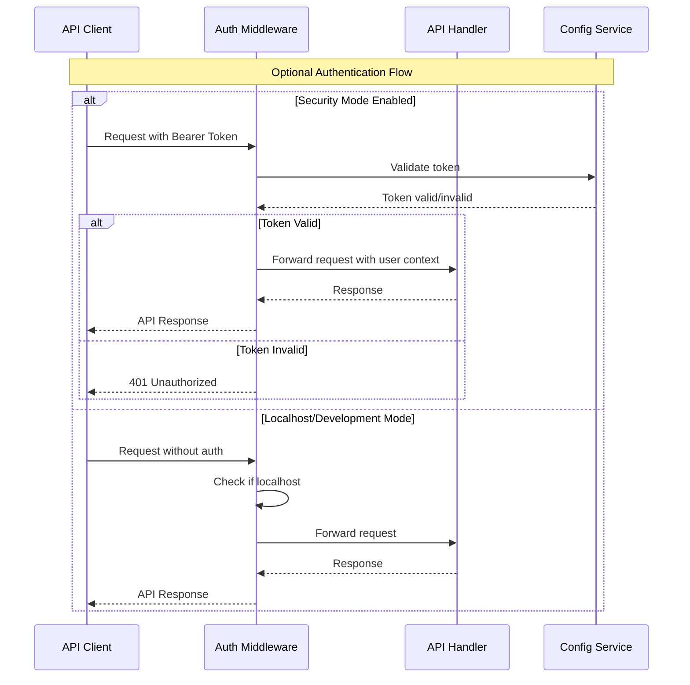

# Backend Architecture

## Service Architecture

Since we've chosen a traditional monolithic server architecture, the backend is organized around Go packages and services within a single binary.

### Controller Organization

```text
internal/
├── capture/                  # Packet capture service
│   ├── engine.go            # AF_PACKET capture engine
│   ├── ring_buffer.go       # TPACKETv3 ring buffer implementation
│   ├── packet_parser.go     # Packet header extraction
│   └── interface_manager.go # Network interface management
├── flow/                    # Flow processing service  
│   ├── aggregator.go        # Packet-to-flow aggregation
│   ├── storage.go           # In-memory flow storage
│   ├── indexer.go           # Multi-index management
│   └── cleaner.go           # Flow aging and cleanup
├── api/                     # HTTP API controllers
│   ├── router.go            # Route definitions
│   ├── handlers/            # HTTP handlers
│   │   ├── flows.go         # Flow query endpoints
│   │   ├── metrics.go       # System metrics endpoints
│   │   ├── health.go        # Health check endpoints
│   │   └── websocket.go     # WebSocket upgrade handler
│   └── middleware/          # HTTP middleware
│       ├── cors.go          # CORS handling
│       ├── auth.go          # Optional authentication
│       ├── rate_limit.go    # Rate limiting
│       └── logging.go       # Request logging
├── metrics/                 # System monitoring
│   ├── collector.go         # Metrics collection
│   ├── storage.go           # Time-series storage
│   └── calculator.go        # Statistics calculation
├── websocket/               # Real-time streaming
│   ├── manager.go           # Connection management
│   ├── broadcaster.go       # Message broadcasting
│   └── client.go            # Individual client handling
└── config/                  # Configuration management
    ├── config.go            # Configuration structs
    ├── validation.go        # Config validation
    └── defaults.go          # Default values
```

## Authentication and Authorization

### Auth Flow


