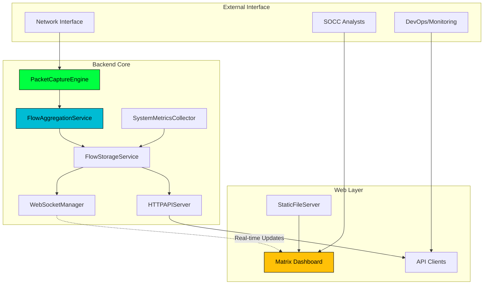

# Components

## PacketCaptureEngine

**Responsibility:** High-performance packet capture from network interfaces using AF_PACKET with TPACKETv3 ring buffers, handling raw packet processing and initial header extraction.

**Key Interfaces:**
- StartCapture(interfaceName string) error - Initialize packet capture on specified interface
- StopCapture() error - Gracefully shutdown packet capture with resource cleanup
- PacketChannel() <-chan RawPacket - Stream of captured packets for processing

**Dependencies:** Linux kernel AF_PACKET support, CAP_NET_RAW capability, network interface access

**Technology Stack:** Go with syscall package for raw socket creation, TPACKETv3 ring buffer implementation, lock-free circular buffer for packet queue management

## FlowAggregationService

**Responsibility:** Transform raw packets into network flows by aggregating 5-tuple connections, maintaining flow state, and managing flow lifecycle including aging and cleanup.

**Key Interfaces:**
- ProcessPacket(packet RawPacket) error - Process individual packet into flow aggregation
- GetFlow(flowKey string) (NetworkFlow, error) - Retrieve specific flow by identifier
- GetActiveFlows(filters FlowFilter) ([]NetworkFlow, error) - Query flows with filtering

**Dependencies:** PacketCaptureEngine packet stream, FlowStorageService for persistence, SystemMetricsCollector for statistics

**Technology Stack:** Go with concurrent-safe maps, custom 5-tuple hashing, time-based flow aging, memory pool management for packet processing

## FlowStorageService

**Responsibility:** In-memory storage and indexing of network flows with efficient query capabilities, memory management within 60-minute retention window, and multi-index support.

**Key Interfaces:**
- StoreFlow(flow NetworkFlow) error - Persist flow data with indexing
- QueryFlows(query FlowQuery) (FlowResult, error) - Execute complex flow queries
- GetTopTalkers(duration time.Duration) ([]TopTalker, error) - Calculate bandwidth rankings

**Dependencies:** None (self-contained in-memory storage)

**Technology Stack:** Go with sync.RWMutex for concurrent access, custom B-tree indexes for IP/port ranges, LRU eviction for memory management, bitmap indexing for protocol filtering

## WebSocketManager

**Responsibility:** Real-time data streaming to connected dashboard clients, managing WebSocket connections, message queuing, and client lifecycle including reconnection handling.

**Key Interfaces:**
- RegisterClient(conn WebSocketConnection) string - Add new dashboard client
- BroadcastFlowUpdate(flows []NetworkFlow) error - Send flow updates to all clients  
- BroadcastMetricsUpdate(metrics SystemMetrics) error - Send system metrics to clients

**Dependencies:** FlowStorageService for data subscription, SystemMetricsCollector for metrics streaming, HTTP server for WebSocket upgrades

**Technology Stack:** Gorilla WebSocket library, JSON message serialization, client connection pooling, message throttling and queuing

## SystemMetricsCollector

**Responsibility:** System performance monitoring including CPU/memory usage, packet capture statistics, and application health metrics with configurable collection intervals.

**Key Interfaces:**
- CollectMetrics() (SystemMetrics, error) - Gather current system performance data
- GetHistoricalMetrics(duration time.Duration) ([]SystemMetrics, error) - Retrieve time-series data
- StartCollection(interval time.Duration) error - Begin periodic metrics collection

**Dependencies:** PacketCaptureEngine for capture statistics, FlowStorageService for flow counts, OS interfaces for system metrics

**Technology Stack:** Go runtime metrics, /proc filesystem parsing for Linux system stats, rolling window data structure for historical storage, structured logging integration

## HTTPAPIServer

**Responsibility:** REST API endpoint handling for programmatic access, request routing, authentication, rate limiting, and response formatting with OpenAPI compliance.

**Key Interfaces:**
- StartServer(port int) error - Initialize HTTP server with routing
- RegisterRoutes(routes []APIRoute) error - Configure API endpoint handlers
- EnableAuthentication(config AuthConfig) error - Activate optional token-based auth

**Dependencies:** FlowStorageService for data queries, SystemMetricsCollector for metrics endpoints, WebSocketManager for WebSocket upgrades

**Technology Stack:** Go net/http standard library, gorilla/mux for routing, middleware chain for auth/logging, JSON response formatting, CORS handling

## StaticFileServer

**Responsibility:** Embedded web asset delivery including HTML, CSS, JavaScript files using Go embed, with efficient caching headers and matrix-themed dashboard serving.

**Key Interfaces:**
- ServeAssets(fs embed.FS) http.Handler - Create file server from embedded assets
- SetCacheHeaders(duration time.Duration) - Configure browser caching policy
- ServeIndex() http.HandlerFunc - Handle SPA routing with index.html fallback

**Dependencies:** Embedded web assets, HTTP server for request handling

**Technology Stack:** Go embed package for asset compilation, http.FileServer for static serving, custom middleware for cache headers, gzip compression support

## Component Diagrams

