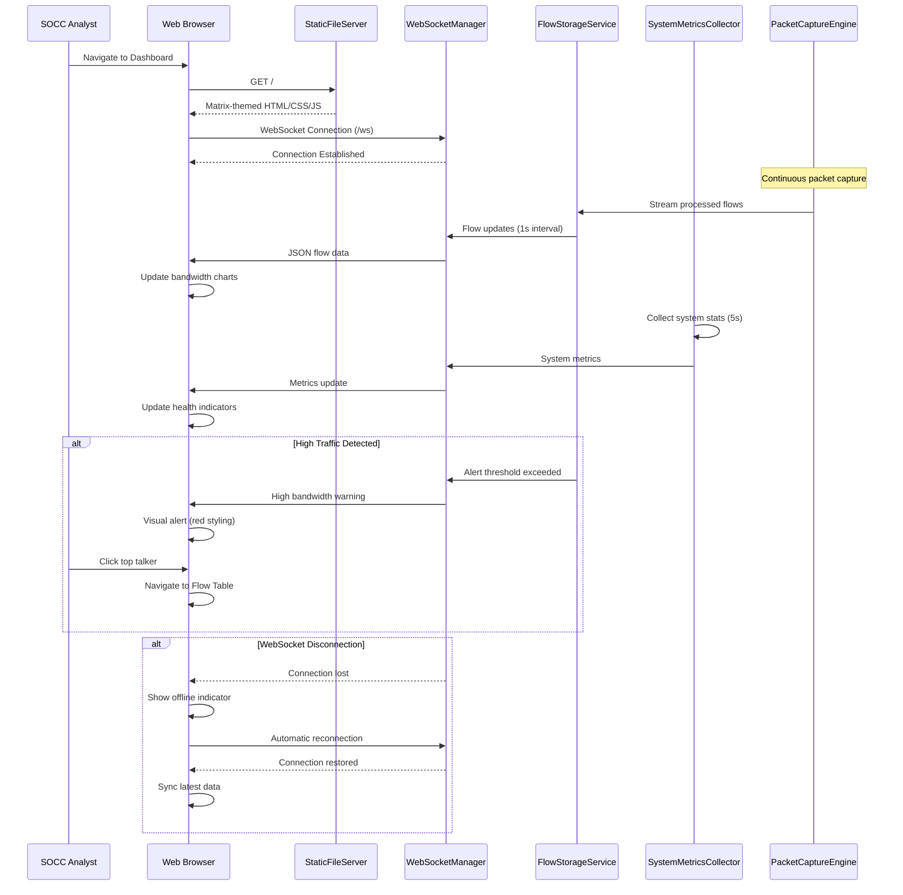
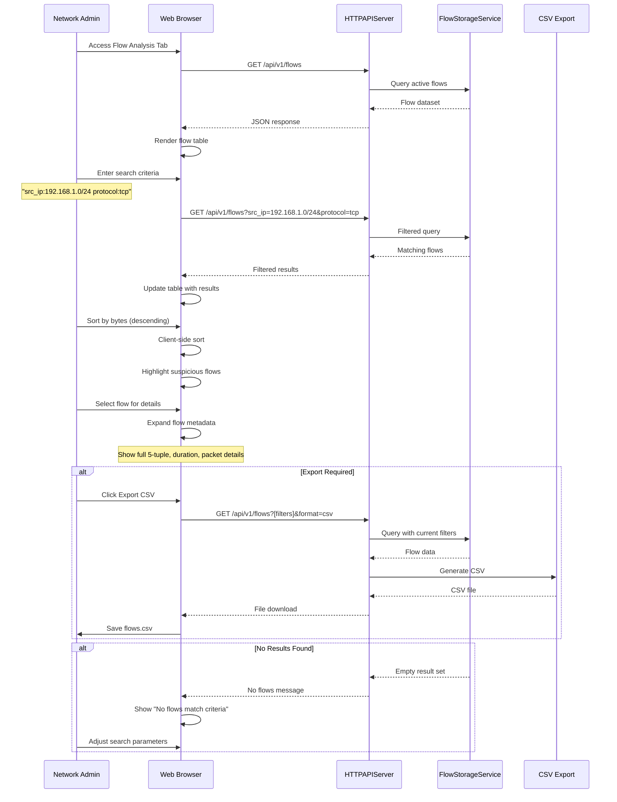
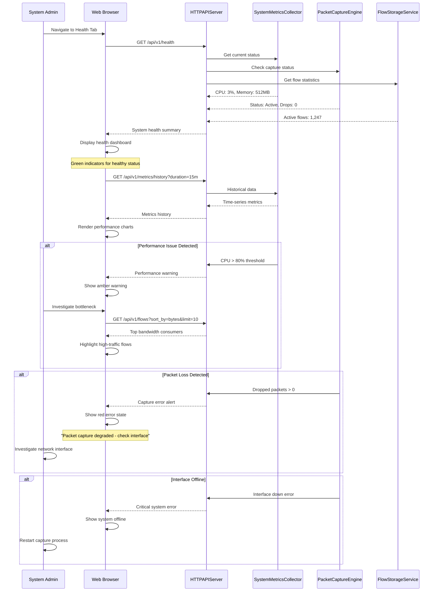

# Core Workflows

## Real-time Network Monitoring Workflow

```mermaid
sequenceDiagram
    participant User as SOCC Analyst
    participant Browser as Web Browser
    participant Static as StaticFileServer
    participant WS as WebSocketManager
    participant Storage as FlowStorageService
    participant Metrics as SystemMetricsCollector
    participant Capture as PacketCaptureEngine

    User->>Browser: Navigate to Dashboard
    Browser->>Static: GET /
    Static-->>Browser: Matrix-themed HTML/CSS/JS
    Browser->>WS: WebSocket Connection (/ws)
    WS-->>Browser: Connection Established

    Note over Capture: Continuous packet capture
    Capture->>Storage: Stream processed flows
    Storage->>WS: Flow updates (1s interval)
    WS->>Browser: JSON flow data
    Browser->>Browser: Update bandwidth charts

    Metrics->>Metrics: Collect system stats (5s)
    Metrics->>WS: System metrics
    WS->>Browser: Metrics update
    Browser->>Browser: Update health indicators

    alt High Traffic Detected
        Storage->>WS: Alert threshold exceeded
        WS->>Browser: High bandwidth warning
        Browser->>Browser: Visual alert (red styling)
        User->>Browser: Click top talker
        Browser->>Browser: Navigate to Flow Table
    end

    alt WebSocket Disconnection
        WS-->>Browser: Connection lost
        Browser->>Browser: Show offline indicator
        Browser->>WS: Automatic reconnection
        WS-->>Browser: Connection restored
        Browser->>Browser: Sync latest data
    end
```

## Network Issue Investigation Workflow

```mermaid
sequenceDiagram
    participant User as Network Admin
    participant Browser as Web Browser
    participant API as HTTPAPIServer
    participant Storage as FlowStorageService
    participant Export as CSV Export

    User->>Browser: Access Flow Analysis Tab
    Browser->>API: GET /api/v1/flows
    API->>Storage: Query active flows
    Storage-->>API: Flow dataset
    API-->>Browser: JSON response
    Browser->>Browser: Render flow table

    User->>Browser: Enter search criteria
    Note over User: "src_ip:192.168.1.0/24 protocol:tcp"
    Browser->>API: GET /api/v1/flows?src_ip=192.168.1.0/24&protocol=tcp
    API->>Storage: Filtered query
    Storage-->>API: Matching flows
    API-->>Browser: Filtered results
    Browser->>Browser: Update table with results

    User->>Browser: Sort by bytes (descending)
    Browser->>Browser: Client-side sort
    Browser->>Browser: Highlight suspicious flows

    User->>Browser: Select flow for details
    Browser->>Browser: Expand flow metadata
    Note over Browser: Show full 5-tuple, duration, packet details

    alt Export Required
        User->>Browser: Click Export CSV
        Browser->>API: GET /api/v1/flows?[filters]&format=csv
        API->>Storage: Query with current filters
        Storage-->>API: Flow data
        API->>Export: Generate CSV
        Export-->>API: CSV file
        API-->>Browser: File download
        Browser->>User: Save flows.csv
    end

    alt No Results Found
        Storage-->>API: Empty result set
        API-->>Browser: No flows message
        Browser->>Browser: Show "No flows match criteria"
        User->>Browser: Adjust search parameters
    end
```

## System Health Verification Workflow

```mermaid
sequenceDiagram
    participant Admin as System Admin
    participant Browser as Web Browser
    participant API as HTTPAPIServer
    participant Metrics as SystemMetricsCollector
    participant Capture as PacketCaptureEngine
    participant Storage as FlowStorageService

    Admin->>Browser: Navigate to Health Tab
    Browser->>API: GET /api/v1/health
    API->>Metrics: Get current status
    API->>Capture: Check capture status
    API->>Storage: Get flow statistics
    
    Metrics-->>API: CPU: 3%, Memory: 512MB
    Capture-->>API: Status: Active, Drops: 0
    Storage-->>API: Active flows: 1,247
    API-->>Browser: System health summary

    Browser->>Browser: Display health dashboard
    Note over Browser: Green indicators for healthy status

    Browser->>API: GET /api/v1/metrics/history?duration=15m
    API->>Metrics: Historical data
    Metrics-->>API: Time-series metrics
    API-->>Browser: Metrics history
    Browser->>Browser: Render performance charts

    alt Performance Issue Detected
        Metrics->>API: CPU > 80% threshold
        API-->>Browser: Performance warning
        Browser->>Browser: Show amber warning
        Admin->>Browser: Investigate bottleneck
        Browser->>API: GET /api/v1/flows?sort_by=bytes&limit=10
        API-->>Browser: Top bandwidth consumers
        Browser->>Browser: Highlight high-traffic flows
    end

    alt Packet Loss Detected
        Capture->>API: Dropped packets > 0
        API-->>Browser: Capture error alert
        Browser->>Browser: Show red error state
        Note over Browser: "Packet capture degraded - check interface"
        Admin->>Admin: Investigate network interface
    end

    alt Interface Offline
        Capture->>API: Interface down error
        API-->>Browser: Critical system error
        Browser->>Browser: Show system offline
        Admin->>Admin: Restart capture process
    end
```
