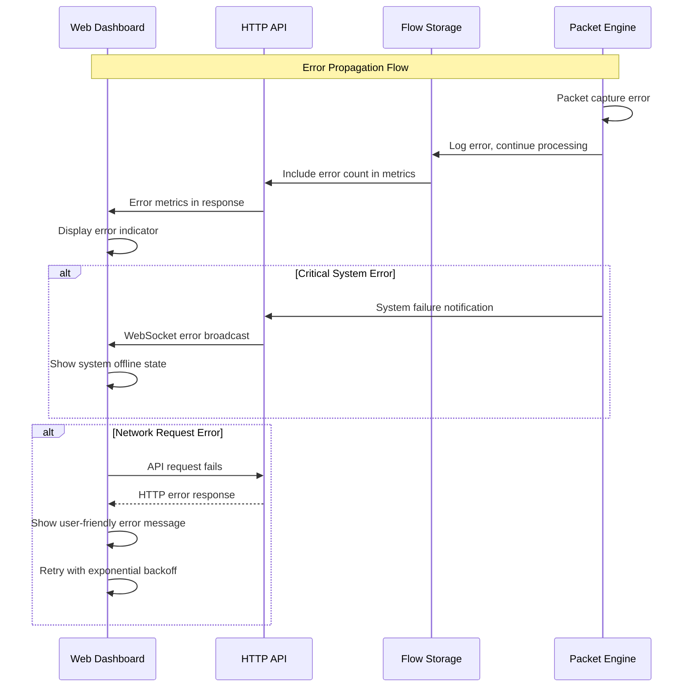

# Error Handling Strategy

## Error Flow



## Error Response Format

```typescript
interface ApiError {
  error: {
    code: string;
    message: string;
    details?: Record<string, any>;
    timestamp: string;
    requestId: string;
  };
}
```

## Frontend Error Handling

```javascript
class ErrorHandler {
    static handleApiError(error, context) {
        const userMessage = this.getUserFriendlyMessage(error.code);
        appState.setState('ui.error', userMessage);
        
        // Log full error details for debugging
        console.error('API Error:', {
            code: error.code,
            message: error.message,
            context: context,
            timestamp: error.timestamp
        });
    }
    
    static getUserFriendlyMessage(errorCode) {
        const messages = {
            'CAPTURE_FAILED': 'Network capture temporarily unavailable',
            'MEMORY_LIMIT': 'System memory limit reached - older data cleared',
            'INTERFACE_DOWN': 'Network interface offline - check connection'
        };
        return messages[errorCode] || 'System temporarily unavailable';
    }
}
```

## Backend Error Handling

```go
type ErrorHandler struct {
    logger logger.Logger
}

func (h *ErrorHandler) HandleCaptureError(err error, context string) {
    // Log error but don't stop capture
    h.logger.Error("Packet capture error", 
        "error", err, 
        "context", context,
        "action", "continue_processing")
    
    // Update error metrics
    metrics.IncrementCaptureErrors()
}

func (h *ErrorHandler) HandleAPIError(w http.ResponseWriter, err error, requestID string) {
    statusCode := h.getStatusCode(err)
    errorResponse := APIError{
        Error: ErrorDetail{
            Code:      h.getErrorCode(err),
            Message:   h.getUserMessage(err),
            Timestamp: time.Now(),
            RequestID: requestID,
        },
    }
    
    w.Header().Set("Content-Type", "application/json")
    w.WriteHeader(statusCode)
    json.NewEncoder(w).Encode(errorResponse)
}
```
