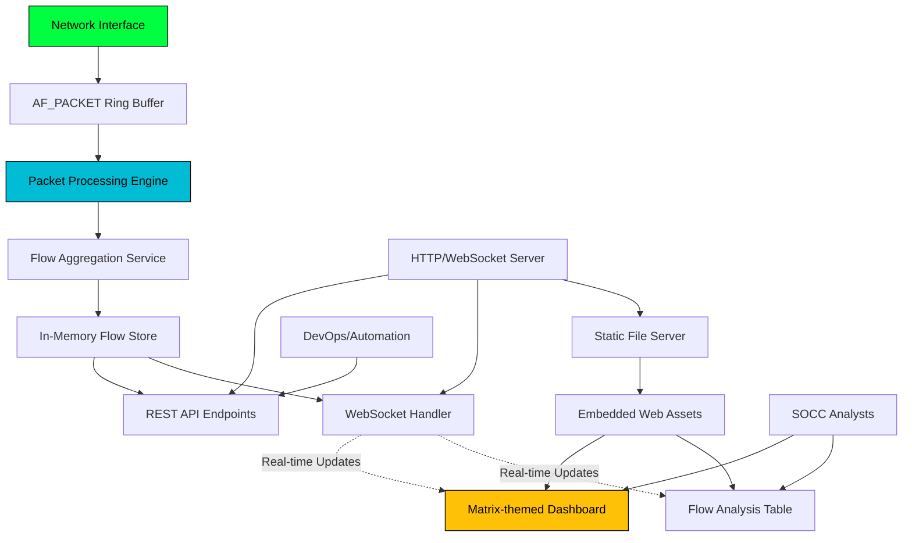

# High Level Architecture

## Technical Summary

Netwatch implements a **high-performance Go monolith architecture** with embedded web assets for zero-infrastructure deployment. The backend leverages AF_PACKET with TPACKETv3 ring buffers for efficient packet capture at 1 Gbps speeds, while the frontend delivers a matrix-themed real-time dashboard using vanilla JavaScript with WebSocket streaming. The system maintains sub-second latency through direct memory management and lock-free data structures, serving both REST APIs for programmatic access and an embedded web interface for SOCC analysts. This single-binary approach eliminates deployment complexity while achieving enterprise-grade performance targets of <5% CPU utilization and <1GB memory usage during continuous network monitoring operations.

## Platform and Infrastructure Choice

**Analysis of Platform Options:**

**Option 1: Bare Metal/VM Deployment**
- ✅ **Pros:** Direct hardware access for packet capture, maximum performance, full control over networking stack
- ❌ **Cons:** Manual deployment, no auto-scaling, infrastructure management overhead
- **Fit:** Excellent - packet capture requires privileged access and predictable performance

**Option 2: Container Platform (Docker/Kubernetes)**
- ✅ **Pros:** Portable deployment, orchestration capabilities, easier updates
- ❌ **Cons:** Networking abstraction complicates packet capture, privileged containers required
- **Fit:** Possible but complex due to CAP_NET_RAW requirements

**Option 3: Cloud Functions/Serverless**
- ❌ **Pros:** Auto-scaling, managed infrastructure
- ❌ **Cons:** Cannot access raw network interfaces, unsuitable for continuous packet capture
- **Fit:** Not viable for this use case

**Recommendation:** **Bare Metal/VM Deployment** with containerization as optional deployment method.

**Platform:** Linux bare metal or VMs with direct network interface access
**Key Services:** Single Go binary with embedded web server, no external dependencies
**Deployment Host and Regions:** On-premises or cloud VMs with network monitoring privileges

## Repository Structure

**Structure:** Monorepo with specialized Go project layout
**Monorepo Tool:** Native Go modules (no additional tooling needed for this focused project)
**Package Organization:** Standard Go project structure with embedded frontend assets

**Rationale:** Given the single-binary constraint and Go-centric nature, a simple Go module structure is most appropriate. The frontend assets are embedded rather than being a separate deployable unit, so traditional fullstack monorepo tools (Turborepo, Nx) would add unnecessary complexity.

## High Level Architecture Diagram

## Architectural Patterns

- **High-Performance Monolith:** Single binary with tightly coupled components for minimal latency - _Rationale:_ Packet processing at 1 Gbps requires elimination of inter-service network calls and optimal memory sharing
- **Embedded Assets Pattern:** Static web files compiled into Go binary using embed - _Rationale:_ Enables true single-binary deployment without external file dependencies
- **Lock-Free Data Structures:** Concurrent-safe data structures without traditional locking - _Rationale:_ Essential for maintaining <5% CPU utilization during high-throughput packet processing
- **Ring Buffer Architecture:** Circular buffers for efficient packet queue management - _Rationale:_ Minimizes memory allocation/deallocation overhead in packet processing hot path
- **WebSocket Streaming:** Real-time data push to frontend without polling - _Rationale:_ Sub-second dashboard updates required for network operations effectiveness
- **Repository Pattern:** Abstract data access for flow storage and querying - _Rationale:_ Enables future storage backend changes while maintaining API consistency
- **Component-Based UI:** Modular vanilla JavaScript components with matrix theming - _Rationale:_ Avoids framework overhead while maintaining code organization for specialized cybersecurity interface
